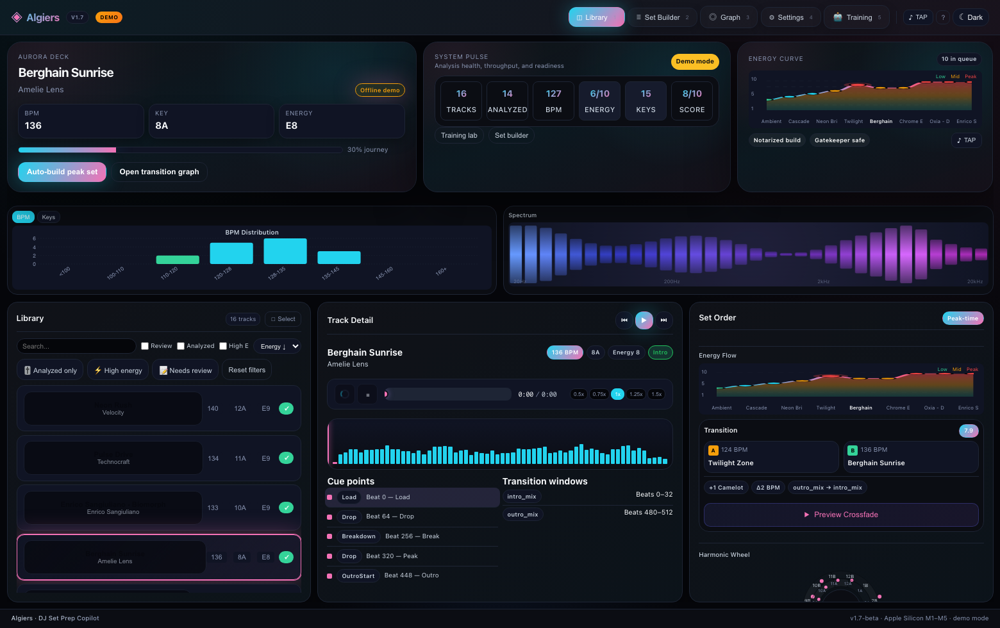
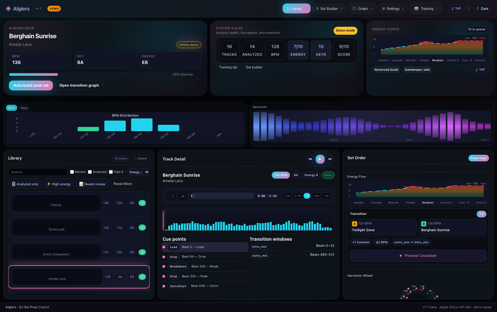
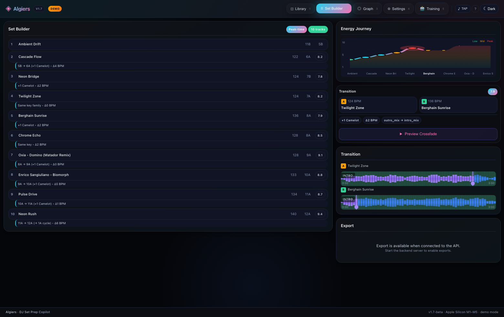
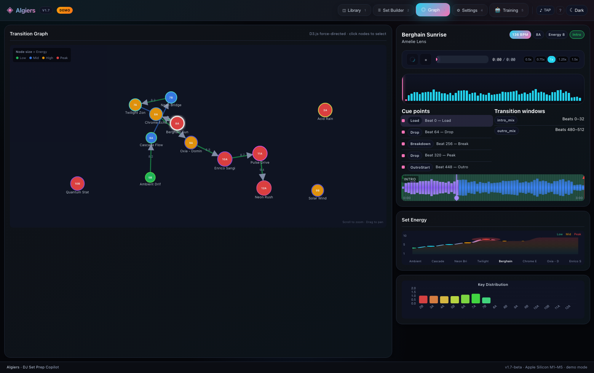
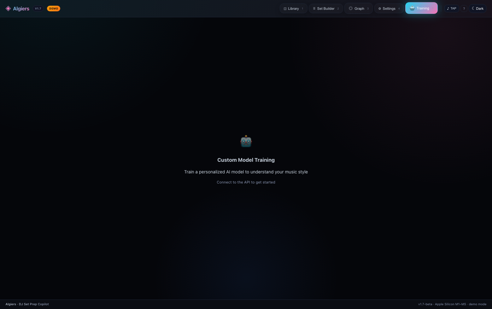
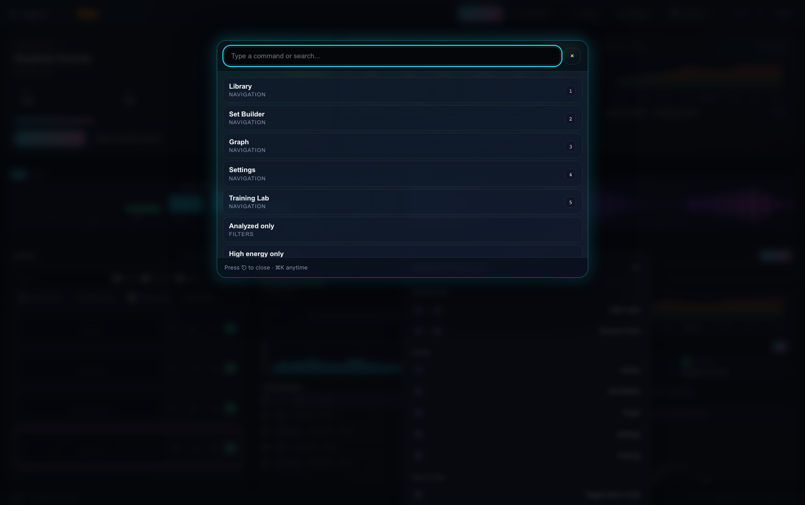

<div align="center">


# Algiers

### The AI-Powered DJ Set Prep Copilot

**Analyze. Match. Plan. Export. — All running locally on your Mac.**

<br/>

[](https://github.com/ParkWardRR/cartomix-Web-Based-DJ-Copilot/releases/download/v1.7-beta/Algiers-v1.7-beta-AppleSilicon.dmg)
[](#installation)
[](#requirements)
[](#requirements)

<br/>

[](LICENSE)
[](#tech-stack)
[](#tech-stack)
[](#tech-stack)
[](#tech-stack)
[](#apple-silicon-optimization)
[](#apple-silicon-optimization)
[](#architecture)
[](#tech-stack)

<br/>



<br/>

**Aurora glass HUD · v1.7-beta (February 1, 2026)**  
**100% Local** · **No Cloud** · **Neural Engine Accelerated** · **Private by Design**

</div>

---

## What is Algiers?

Algiers is a **native macOS application** that transforms how you prep DJ sets. Point it at your music folder, and it will:

| Feature | Description |
|---------|-------------|
| **Analyze** | BPM, musical key, energy levels, song sections, cue points |
| **Match** | Find tracks with similar "vibe" using neural network embeddings |
| **Plan** | Optimize set order with AI-explainable transitions |
| **Export** | Rekordbox, Serato, Traktor, M3U8, JSON formats |

Everything runs **100% locally** on your Mac. Your music **never leaves your device**.

---

## What's New in v1.7-beta (February 1, 2026)

- **Command Palette (⌘K)** — fast navigation, filters, batch analyze, chart mode, and theme toggle in one overlay.
- **HUD polish** — aurora glass skin refined with crisper stats, energy arc lane, and smart journey progress.
- **Local-only pipeline** — GitHub Actions disabled; release verified locally (UI build, Go tests, Swift tests, notarized DMG).

## What's Next (v1.8)

- Apple Music library ingest and smart crate sync.
- Spotify playlist import with key/BPM enrichment.
- Export presets and palette commands for one-click Rekordbox/Serato/Traktor bundles.

---

## Key Features

### Neural-Powered Vibe Matching

OpenL3 neural network creates **512-dimensional embeddings** for each track, capturing the sonic "vibe" beyond just BPM and key:

```
Similar tracks to "Get Lucky":
├─ Lose Yourself to Dance (92% match) — same vibe, same key
├─ Redbone (78% match) — similar vibe, Δ-4 BPM
└─ Midnight City (71% match) — similar energy arc
```

### Intelligent Set Planning

Weighted graph optimization considers multiple factors:

- **Tempo compatibility** — BPM delta and beatgrid alignment
- **Harmonic mixing** — Camelot wheel key relationships
- **Energy flow** — Building and dropping intensity
- **Vibe continuity** — OpenL3 similarity scores

Every transition shows **why** it works:

```
"similar vibe (82%); Δ+2 BPM; key: 8A→9A (compatible); energy +1"
```

### Waveform Section Editing

Edit track sections directly on the waveform canvas:
- **Click + drag** to create new sections
- **Resize handles** on section edges
- **Right-click menu** for section type selection
- **8 section types**: Intro, Build, Drop, Breakdown, Outro, Verse, Chorus, Body

### Batch Operations

Efficient bulk track management:
- **Select All / Select None** with one click
- **Multi-select mode** with checkboxes
- **Batch analyze** multiple tracks simultaneously
- **Keyboard shortcuts** for power users

### Keyboard Shortcuts

| Category | Shortcut | Action |
|----------|----------|--------|
| Navigation | `↓` / `J` | Next track |
| Navigation | `↑` / `K` | Previous track |
| Views | `1` - `5` | Switch between Library, Set Builder, Graph, Settings, Training |
| Selection | `S` | Toggle batch select mode |
| Selection | `⌘A` | Select all tracks |
| Selection | `Space` | Toggle selection on current track |
| Tempo | `T` | Tap for BPM detection |
| Help | `?` | Show keyboard shortcuts |

### Harmonic Mixing Assistant

Interactive Camelot wheel for harmonic mixing:
- **Visual key compatibility** — See which keys mix well at a glance
- **Color-coded legend** — Green (perfect), Blue (compatible), Yellow (energy shift)
- **Track distribution** — Dots show which keys are in your library
- **One-click filtering** — Click wheel segments to filter by key

| Relationship | Color | Description |
|--------------|-------|-------------|
| Perfect | Green | Same key — seamless mix |
| Compatible | Blue | ±1 on wheel — smooth transition |
| Energy Shift | Yellow | Relative major/minor — mood change |

### BPM Tap Detection

Tap tempo feature for detecting BPM from external audio sources:
- **Tap button or press T** — Tap along with the beat to detect BPM
- **Smart averaging** — Uses last 8 taps for accurate tempo detection
- **Auto-reset** — Automatically resets after 2 seconds of inactivity
- **Visual feedback** — Beat indicator shows current tap position
- **DJ range clamping** — Automatically doubles or halves extreme tempos

### Library Statistics

Real-time insights into your music collection:
- **Track counts** — Total tracks and analyzed percentage
- **BPM analysis** — Average BPM and tempo range distribution
- **Energy metrics** — Average energy level across your library
- **Key distribution** — Visual breakdown of keys in your collection

### Live Crossfade Preview

Preview transitions between tracks with real audio playback:
- **Dual-track playback** — Hear both tracks simultaneously during crossfade
- **Adjustable transition point** — Set where the mix begins (50-95% into track A)
- **Configurable crossfade duration** — 4 to 32 seconds
- **Visual volume meters** — See the crossfade curve in real-time
- **Web Audio API powered** — Native browser audio with HTTP Range support

### Custom ML Model Training

Train a personalized AI model that understands your music style:
- **Visual waveform labeling** — Click and drag on waveforms to label sections
- **7 section types** — Intro, Build, Drop, Break, Outro, Verse, Chorus
- **Keyboard shortcuts** — Press 1-7 to select label type, Enter to add
- **Real-time training** — Watch progress with accuracy/F1 metrics
- **Model versioning** — Compare and activate different model versions
- **Local training** — Your training data never leaves your Mac

| Shortcut | Label |
|----------|-------|
| `1` | Intro |
| `2` | Build |
| `3` | Drop |
| `4` | Break |
| `5` | Outro |
| `6` | Verse |
| `7` | Chorus |

### Set History & Session Tracking

Track and recall your DJ sessions with persistent localStorage-based history:
- **Save sessions** — Name and annotate your set plans for future reference
- **Session stats** — Track total sessions, tracks used, and favorite modes
- **Quick search** — Find past sessions by name or notes
- **Load & resume** — Reload any previous set into the Set Builder
- **Delete management** — Clean up old sessions when no longer needed
- **Auto-persistence** — All data stored locally in browser storage

| Stat | Description |
|------|-------------|
| Total Sessions | Number of saved set plans |
| Total Tracks | Cumulative tracks across all sessions |
| Avg per Set | Average tracks per session |
| Favorite Mode | Most frequently used set mode |

---

## Screenshots

<table>
<tr>
<td align="center"><b>Aurora Library</b></td>
<td align="center"><b>Set Builder</b></td>
<td align="center"><b>Transition Graph</b></td>
</tr>
<tr>
<td></td>
<td></td>
<td></td>
</tr>
<tr>
<td align="center"><b>Energy HUD</b></td>
<td align="center"><b>Training Lab</b></td>
<td align="center"><b>Command Palette</b></td>
</tr>
<tr>
<td></td>
<td></td>
<td></td>
</tr>
</table>

---

## Installation

### Download (Recommended)

**[Download Algiers v1.7-beta](https://github.com/ParkWardRR/cartomix-Web-Based-DJ-Copilot/releases/download/v1.7-beta/Algiers-v1.7-beta-AppleSilicon.dmg)** (~21 MB)

1. Open the DMG
2. Drag **Algiers** to Applications
3. Double-click to launch

> **Note:** The app is signed and notarized by Apple — no Gatekeeper warnings.

### Build from Source

```bash
git clone https://github.com/ParkWardRR/cartomix-Web-Based-DJ-Copilot.git
cd cartomix-Web-Based-DJ-Copilot
bash scripts/build-and-notarize.sh
open build/Algiers.app
```

---

## Requirements

| Requirement | Minimum |
|-------------|---------|
| **macOS** | 14.0 (Sonoma) or later |
| **Chip** | Apple Silicon (M1 / M2 / M3 / M4) |
| **RAM** | 8 GB |
| **Storage** | 500 MB |

> **Note:** Intel Macs are not supported. Algiers requires Metal GPU and Neural Engine for ML inference.

---

## Architecture

Algiers bundles three optimized components in a single app:

```
Algiers.app/
├── MacOS/Algiers               # SwiftUI app shell (WebView + process management)
├── Helpers/
│   ├── algiers-engine          # Go HTTP server + set planner + SQLite storage
│   └── analyzer-swift          # Apple Silicon audio analyzer (vDSP + Core ML)
└── Resources/
    ├── Models/
    │   └── OpenL3.mlpackage    # Core ML model for vibe matching (~15MB)
    └── web/                    # React frontend (production build)
```

### Data Flow

```
┌─────────────┐     HTTP      ┌────────────────┐     gRPC      ┌─────────────────┐
│   React UI  │ ◄──────────► │  Go Engine     │ ◄───────────► │  Swift Analyzer │
│  (WebView)  │    REST API   │  (HTTP:8080)   │    Proto3     │  (gRPC:50052)   │
└─────────────┘               └────────────────┘               └─────────────────┘
                                     │                                  │
                                     ▼                                  ▼
                              ┌──────────────┐                ┌──────────────────┐
                              │   SQLite DB  │                │   Core ML Model  │
                              │  (WAL mode)  │                │   (Neural Engine)│
                              └──────────────┘                └──────────────────┘
```

---

## Tech Stack

### Frontend

| Technology | Version | Purpose |
|------------|---------|---------|
| **React** | 19 | UI framework with concurrent rendering |
| **TypeScript** | 5.6 | Type-safe development |
| **Vite** | 7.3 | Build tooling with HMR |
| **Framer Motion** | 12 | Fluid animations |
| **D3.js** | 7 | Force-directed transition graph |
| **Zustand** | 5 | State management |

### Backend

| Technology | Version | Purpose |
|------------|---------|---------|
| **Go** | 1.24 | HTTP server, set planner, graph algorithms |
| **SQLite** | 3.46 | Local database with WAL mode |
| **gRPC** | 1.65 | High-performance analyzer communication |
| **Protocol Buffers** | 3 | Binary serialization |

### Analyzer

| Technology | Purpose |
|------------|---------|
| **Swift 6** | Native Apple Silicon performance |
| **Accelerate vDSP** | FFT, spectrograms, signal processing |
| **Core ML** | Neural Engine inference for OpenL3 |
| **AVFoundation** | Audio decode (FLAC, AAC, MP3, WAV, AIFF) |
| **Apple Sound Analysis** | Section boundary detection |

---

## Apple Silicon Optimization

Algiers is built specifically for Apple Silicon's unified architecture:

| Engine | Framework | Use Case | Performance |
|--------|-----------|----------|-------------|
| **Neural Engine** | Core ML | OpenL3 embeddings | ~5ms/window |
| **GPU** | Metal | Spectrograms, onset detection | 10x faster than CPU |
| **CPU** | Accelerate vDSP | FFT, key detection, beatgrid | SIMD optimized |
| **Media Engine** | AVFoundation | Audio decode | Hardware accelerated |

**Unified Memory Architecture** means zero-copy data flow between all engines — no data transfer overhead.

### Performance Benchmarks

| Operation | M1 | M2 Pro | M3 Max |
|-----------|-------|--------|--------|
| Full track analysis | ~8s | ~5s | ~3s |
| Vibe embedding | ~2s | ~1.5s | ~1s |
| 100-track set planning | ~200ms | ~150ms | ~100ms |

---

## Audio Analysis

### Beatgrid Detection

- **Multi-pass tempo detection** with confidence scoring
- **Dynamic tempo maps** for tracks with tempo changes
- **Downbeat alignment** for accurate phrase mapping
- **Phase-locked beatgrid** at millisecond precision

### Key Detection

- **Krumhansl-Schmuckler** pitch class profiling
- **Camelot notation** output (1A-12B)
- **Open Key** notation support
- **Confidence scoring** for ambiguous keys

### Section Tagging

Automatic detection of DJ-relevant sections:

| Section | Description |
|---------|-------------|
| **Intro** | Opening with minimal elements |
| **Build** | Rising energy and tension |
| **Drop** | Peak energy moment |
| **Breakdown** | Energy reduction, melodic focus |
| **Outro** | Closing section for mixing out |

### Cue Point Suggestions

Up to 8 suggested cue points:

| Cue Type | Purpose |
|----------|---------|
| **Load** | Recommended load point |
| **FirstDownbeat** | First phrase downbeat |
| **Drop** | Main drop entry |
| **Breakdown** | Breakdown entry |
| **Build** | Build-up entry |
| **OutroStart** | Outro mixing point |
| **SafetyLoop** | Emergency loop zone |

---

## Export Formats

| Format | Output Files |
|--------|--------------|
| **Rekordbox** | `DJ_PLAYLISTS.xml` with cues, tempo, key, color coding |
| **Serato** | Binary `.crate` file + cues CSV |
| **Traktor** | NML v19 with `CUE_V2` markers |
| **Generic** | M3U8 playlist, JSON analysis, CSV cues |
| **Bundle** | tar.gz archive with all formats |

---

## Privacy

- Audio files are **never uploaded** anywhere
- Analysis runs **100% locally** on your Mac
- **No telemetry**, no analytics, no cloud sync
- App works completely **offline**
- Database stored in `~/Library/Application Support/Algiers/`

---

## Development

### Project Structure

```
.
├── Algiers/                    # Xcode project (SwiftUI wrapper)
├── analyzer-swift/             # Swift audio analyzer
│   ├── Sources/
│   │   └── AudioAnalyzer/      # Core analysis engine
│   └── Package.swift
├── cmd/engine/                 # Go HTTP server
│   ├── main.go
│   ├── handlers/               # REST API handlers
│   ├── planner/                # Set optimization
│   └── storage/                # SQLite repository
├── web/                        # React frontend
│   ├── src/
│   │   ├── components/         # UI components
│   │   ├── hooks/              # Custom hooks
│   │   └── store.ts            # Zustand state
│   └── package.json
├── scripts/
│   └── build-and-notarize.sh   # Full build pipeline
└── docs/
    └── assets/                 # Screenshots, logo
```

### Development Mode

```bash
# Terminal 1: Swift analyzer
cd analyzer-swift
swift build -c release
.build/release/analyzer-swift serve --port 50052 --proto grpc

# Terminal 2: Go engine
go run ./cmd/engine --analyzer-addr localhost:50052

# Terminal 3: React frontend
cd web
npm install
npm run dev
```

### Building for Distribution

```bash
# Full build with code signing and notarization
bash scripts/build-and-notarize.sh

# Output: build/Algiers-v1.7-beta-AppleSilicon.dmg
```

---

## Roadmap

### Completed

- [x] Standalone macOS app with code signing
- [x] Apple notarization for Gatekeeper
- [x] Intro wizard for first-run onboarding
- [x] OpenL3 neural vibe matching
- [x] Rekordbox/Serato/Traktor export
- [x] Drag-and-drop folder import
- [x] Real-time analysis progress indicator
- [x] Modern UI with gradient styling
- [x] Waveform-based section editing
- [x] Batch operations (select all, analyze all)
- [x] Keyboard shortcuts for power users
- [x] Harmonic mixing assistant (Camelot wheel)
- [x] BPM tap detection
- [x] Library statistics and insights
- [x] Live audio preview with crossfade simulation
- [x] Custom ML model training with visual waveform labeler
- [x] Set history and session tracking

### Planned

- [ ] Apple Music library integration
- [ ] Spotify playlist import

---

## Contributing

1. Fork the repository
2. Create a feature branch (`git checkout -b feature/amazing`)
3. Commit your changes (`git commit -m 'Add amazing feature'`)
4. Push to the branch (`git push origin feature/amazing`)
5. Open a Pull Request

---

## License

Blue Oak Model License 1.0.0. See [LICENSE](LICENSE).

---

<div align="center">

### Built for DJs who want to prep smarter, not harder.

<br/>

*Made with Swift, Go, React, and way too much coffee.*

<br/>

**[Download Algiers](https://github.com/ParkWardRR/cartomix-Web-Based-DJ-Copilot/releases/download/v1.7-beta/Algiers-v1.7-beta-AppleSilicon.dmg)**

</div>
