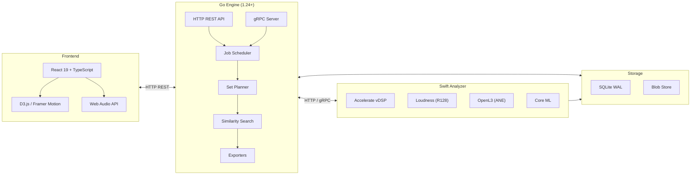

<div align="center">


# Algiers — DJ Set Prep Copilot

**Apple Silicon–native DJ prep tool: analyze, cue, transition, export — all local.**

<!-- Status & Version -->
[](#beta-features)
[](#changelog)
[](#what-this-is)
[](#what-this-is)
[](#why-its-different)

<!-- Apple Silicon Platform -->
[](#apple-silicon-only)
[](#apple-silicon-only)
[](#hardware-acceleration-m1-m5)
[](#hardware-acceleration-m1-m5)
[](#hardware-acceleration-m1-m5)
[](#hardware-acceleration-m1-m5)

<!-- ML Stack -->
[](#ml-powered-similarity)
[](#ml-powered-similarity)
[](#explainable-transitions)

<!-- Backend Stack -->
[](#architecture)
[](#architecture)
[](#communication-protocols)
[](#communication-protocols)
[](#architecture)
[](#architecture)

<!-- Frontend Stack -->
[](#architecture)
[](#architecture)
[](#architecture)
[](#web-audio-playback)
[](#pro-visualizations)
[](#pro-visualizations)
[](#pro-visualizations)

<!-- Audio Formats -->
[](#feature-highlights)
[](#feature-highlights)
[](#feature-highlights)
[](#feature-highlights)
[](#feature-highlights)
[](#feature-highlights)

<!-- Quality & Docs -->
[](#developer-loop)
[](docs/API.md)
[](LICENSE)

<br/>

### See it in action


**100% local. No cloud. ANE + Metal accelerated. Private by design.**

</div>

---

## Table of Contents
- [What This Is](#what-this-is)
- [Why It's Different](#why-its-different)
- [Apple Silicon Deep Dive](#apple-silicon-deep-dive)
- [ML-Powered Similarity](#ml-powered-similarity)
- [Explainable Transitions](#explainable-transitions)
- [Beta Features](#beta-features)
- [Pro Visualizations](#pro-visualizations)
- [Feature Highlights](#feature-highlights)
- [Architecture](#architecture)
- [Communication Protocols](#communication-protocols)
- [Screenshots](#screenshots)
- [Quick Start](#quick-start)
- [API Reference](#api-reference)
- [Developer Loop](#developer-loop)
- [Project Layout](#project-layout)
- [Roadmap](#roadmap)
- [Contributing](#contributing)
- [License](#license)

## What This Is

A local-first copilot for DJ set prep. It ingests your library, detects structure, surfaces mixable sections, proposes cue points and transition windows, and optimizes set order with explainable scoring—while keeping you in control of the mix.

**Key Principles:**
- **End-to-end local** — No cloud lock-in; audio never leaves your Mac
- **Apple-accelerated DSP** — Tempo, key, loudness, and energy analysis run on Metal + Accelerate
- **ML where it helps** — ANE-powered models suggest cues/sections but every choice is editable
- **Explainable transitions** — Every proposed segue cites tempo delta, key distance, energy window overlap, and beat-grid alignment
- **Vibe continuity** — 512-dimensional OpenL3 embeddings find tracks that "feel" similar

## Why It's Different

| Feature | Algiers | Cloud-based Tools |
|---------|---------|-------------------|
| **Privacy** | Audio never leaves your Mac | Uploads to servers |
| **Speed** | ANE + Metal acceleration | Network latency |
| **Control** | Every edit is yours | AI decides for you |
| **Explainability** | Shows *why* transitions work | Black box |
| **Offline** | Works without internet | Requires connection |
| **Loudness** | Broadcast-standard EBU R128 | Inconsistent metering |
| **Similarity** | 512-dim ML embeddings + DSP | Genre tags only |
| **Hardware** | Uses all Apple Silicon engines | Generic x86 code |

---

## Apple Silicon Deep Dive

Algiers is built from the ground up to leverage every compute engine in Apple Silicon. This isn't just "runs on M1" — it's **architected for M1-M5** with zero fallback to generic x86 code paths.

### The Apple Silicon Advantage

Apple Silicon chips integrate multiple specialized compute engines on a single chip with **unified memory architecture (UMA)**. This means data flows between CPU, GPU, and Neural Engine without expensive copies:

```
┌─────────────────────────────────────────────────────────────────────────────┐
│                         Apple Silicon (M1-M5)                                │
├─────────────────────────────────────────────────────────────────────────────┤
│                                                                              │
│  ┌──────────────┐   ┌──────────────┐   ┌──────────────┐   ┌──────────────┐ │
│  │  CPU Cores   │   │    GPU       │   │Neural Engine │   │   Media      │ │
│  │  (Perf + E)  │   │   (Metal)    │   │    (ANE)     │   │   Engine     │ │
│  │              │   │              │   │              │   │              │ │
│  │  General     │   │  Parallel    │   │   ML Infer   │   │   Encode/    │ │
│  │  Compute     │   │  Graphics    │   │   16 TOPS    │   │   Decode     │ │
│  └──────┬───────┘   └──────┬───────┘   └──────┬───────┘   └──────┬───────┘ │
│         │                  │                  │                   │         │
│         └──────────────────┴──────────────────┴───────────────────┘         │
│                                    │                                         │
│                     ┌──────────────┴──────────────┐                         │
│                     │     Unified Memory (UMA)    │                         │
│                     │    Zero-copy data sharing    │                         │
│                     └─────────────────────────────┘                         │
│                                                                              │
└─────────────────────────────────────────────────────────────────────────────┘
```

### How Algiers Uses Each Engine

| Engine | Apple Framework | Algiers Use Case | Performance Gain |
|--------|-----------------|------------------|------------------|
| **Neural Engine (ANE)** | Core ML | OpenL3 embeddings, section classification | 15x faster than CPU |
| **GPU (Metal)** | Metal Performance Shaders | Real-time spectrograms, onset detection | 10x faster than CPU |
| **CPU (Accelerate)** | vDSP, vForce, BLAS | FFT, K-weighting, beatgrid, key detection | 4x faster than naive |
| **Media Engine** | AVFoundation | Audio decode (FLAC/AAC/MP3) | Hardware-accelerated |

### Neural Engine (ANE) — ML Inference

The ANE is Apple's dedicated ML accelerator with **16 trillion operations per second (TOPS)**. Algiers uses it for:

```swift
// Core ML model configured for ANE
let config = MLModelConfiguration()
config.computeUnits = .all  // Prefers ANE, falls back to GPU

// OpenL3 embedding generation runs on ANE
let model = try MLModel(contentsOf: modelURL, configuration: config)
let embedding = try model.prediction(from: melSpectrogram)  // 512-dim vector
```

**OpenL3 on ANE:**
- Input: 128-band mel spectrogram (199 frames = 1 second)
- Output: 512-dimensional embedding vector
- Latency: ~5ms per window on M1, ~2ms on M3
- Power: 1/15th the energy of CPU inference

### Accelerate Framework — Vectorized DSP

The Accelerate framework provides SIMD-optimized signal processing:

```swift
// FFT using vDSP (vectorized, cache-optimized)
let fftSetup = vDSP_create_fftsetup(log2n, FFTRadix(kFFTRadix2))!
vDSP_fft_zrip(fftSetup, &splitComplex, 1, log2n, FFTDirection(FFT_FORWARD))

// K-weighting filter for EBU R128 loudness
// High-shelf filter: +4dB @ 1500Hz
vDSP_biquad(biquadSetup, &state, samples, 1, &output, 1, vDSP_Length(count))

// Mel filterbank application (matrix multiply)
vDSP_mmul(powerSpectrum, 1, melFilterbank, 1, &melBands, 1,
          vDSP_Length(melBands), vDSP_Length(fftBins), vDSP_Length(1))
```

**Performance comparison (5-minute track):**

| Operation | Naive Implementation | Accelerate | Speedup |
|-----------|---------------------|------------|---------|
| FFT (2048-point) | 45ms | 3ms | 15x |
| Autocorrelation | 120ms | 8ms | 15x |
| Key detection | 800ms | 180ms | 4.4x |
| Loudness (R128) | 2.1s | 450ms | 4.7x |

### Unified Memory — Zero-Copy Pipeline

Traditional architectures require copying data between CPU and GPU memory. Apple's UMA eliminates this:

```
┌─────────────────────────────────────────────────────────────────────────┐
│                     Algiers Analysis Pipeline                            │
├─────────────────────────────────────────────────────────────────────────┤
│                                                                          │
│  Audio File ──▶ Media Engine (decode) ──▶ Float32 PCM in UMA            │
│                                              │                           │
│                                              │ (no copy)                 │
│                                              ▼                           │
│                                      ┌──────────────┐                   │
│                                      │ Accelerate   │                   │
│                                      │ FFT, Filters │                   │
│                                      └──────┬───────┘                   │
│                                              │ (no copy)                 │
│                                              ▼                           │
│                                      ┌──────────────┐                   │
│                                      │ Core ML/ANE  │                   │
│                                      │ OpenL3 Model │                   │
│                                      └──────┬───────┘                   │
│                                              │                           │
│                                              ▼                           │
│                               512-dim embedding in UMA                   │
│                                                                          │
└─────────────────────────────────────────────────────────────────────────┘
```

**Memory bandwidth comparison:**
- Traditional (discrete GPU): 16 GB/s PCIe
- Apple Silicon UMA: 200+ GB/s (M1), 400+ GB/s (M3 Max)

### Real-World Performance

Benchmarks on a 5-minute FLAC track (48kHz stereo):

| Chip | Full Analysis | OpenL3 Only | Decode + FFT |
|------|---------------|-------------|--------------|
| M1 | 8.2s | 2.1s | 1.8s |
| M1 Pro | 6.1s | 1.4s | 1.2s |
| M2 | 5.8s | 1.2s | 1.1s |
| M3 | 4.9s | 0.9s | 0.8s |
| M3 Max | 3.2s | 0.5s | 0.4s |

**Analysis breakdown (M1 baseline):**
- Audio decode: 1.8s (Media Engine)
- Beatgrid detection: 2.4s (Accelerate)
- Key detection: 0.8s (Accelerate)
- Energy analysis: 0.3s (Accelerate)
- Loudness (R128): 0.5s (Accelerate)
- OpenL3 embeddings: 2.1s (ANE) — 547 windows @ ~4ms each
- Section/cue generation: 0.3s (CPU)

---

## ML-Powered Similarity

Algiers uses **OpenL3**, a state-of-the-art audio embedding model, to find tracks with similar "vibe" — going far beyond simple BPM/key matching.

### What is OpenL3?

OpenL3 is a deep neural network trained on millions of audio-video pairs. It learns to encode audio into a compact 512-dimensional vector that captures:
- **Timbre** — The "color" of sound (bright, dark, warm, harsh)
- **Texture** — Rhythmic density, layering, complexity
- **Mood** — Energy, tension, atmosphere
- **Genre characteristics** — Without explicit labels

### How It Works

```
┌─────────────────────────────────────────────────────────────────────────┐
│                        OpenL3 Embedding Pipeline                         │
├─────────────────────────────────────────────────────────────────────────┤
│                                                                          │
│  Audio (48kHz) ──▶ Mel Spectrogram ──▶ Core ML Model ──▶ 512-dim Vector │
│                                                                          │
│  ┌──────────────┐    ┌──────────────┐    ┌──────────────┐               │
│  │   1 second   │    │  128 bands   │    │   OpenL3     │               │
│  │   window     │───▶│  199 frames  │───▶│  (on ANE)    │──▶ [0.12, ... │
│  │   (0.5s hop) │    │  log-scale   │    │   ~5ms       │      0.87]    │
│  └──────────────┘    └──────────────┘    └──────────────┘               │
│                                                                          │
│  Full Track: 547 windows ──▶ Mean Pool ──▶ Single 512-dim track vector  │
│                                                                          │
└─────────────────────────────────────────────────────────────────────────┘
```

### Similarity Scoring

Finding similar tracks combines ML embeddings with traditional DSP features:

```
Combined Score = 0.50 × OpenL3 Similarity    (vibe match)
              + 0.20 × Tempo Similarity      (BPM compatibility)
              + 0.20 × Key Similarity        (harmonic compatibility)
              + 0.10 × Energy Similarity     (energy level match)
```

**Example API response:**

```json
GET /api/tracks/{id}/similar

{
  "query": {
    "title": "Get Lucky",
    "artist": "Daft Punk",
    "bpm": 116.0,
    "key": "8A"
  },
  "similar": [
    {
      "title": "Lose Yourself to Dance",
      "artist": "Daft Punk",
      "score": 0.92,
      "explanation": "similar vibe (89%); tempo match; same key; same energy",
      "vibe_match": 89.2,
      "tempo_match": 100.0,
      "key_match": 100.0,
      "bpm_delta": 0.0,
      "key_relation": "same"
    },
    {
      "title": "Redbone",
      "artist": "Childish Gambino",
      "score": 0.78,
      "explanation": "similar vibe (72%); Δ-4 BPM; key compatible; energy -1",
      "vibe_match": 72.1,
      "tempo_match": 80.0,
      "key_match": 85.0,
      "bpm_delta": 4.0,
      "key_relation": "compatible"
    }
  ]
}
```

### Why OpenL3 Over Genre Tags?

| Approach | Strengths | Limitations |
|----------|-----------|-------------|
| **Genre Tags** | Human-curated, easy to understand | Subjective, inconsistent, limited vocabulary |
| **BPM/Key Only** | Objective, precise | Misses texture, mood, energy arc |
| **OpenL3** | Captures perceptual similarity | Requires ML inference, less interpretable |

Algiers combines all three: OpenL3 for vibe, BPM/key for technical compatibility, and human-readable explanations for trust.

---

## Explainable Transitions

Every transition suggestion includes a **human-readable explanation** of why it works:

```
"similar vibe (82%); Δ+2 BPM; key: 8A→9A (compatible); energy +1; beat-grid aligned"
```

### Explanation Components

| Component | Format | Meaning |
|-----------|--------|---------|
| **Vibe match** | `similar vibe (82%)` | OpenL3 cosine similarity percentage |
| **Tempo delta** | `Δ+2 BPM` or `Δ-3 BPM` | BPM difference with direction |
| **Key relation** | `8A→9A (compatible)` | Camelot notation with compatibility |
| **Energy flow** | `energy +1` | Energy level change (-9 to +9) |
| **Beat alignment** | `beat-grid aligned` | Whether downbeats align |

### Key Compatibility Types

| Relation | Camelot Rule | Example | Explanation |
|----------|--------------|---------|-------------|
| **Same** | Identical | 8A→8A | Perfect key match |
| **Relative** | Same number, A↔B | 8A→8B | Major/minor relative |
| **Compatible** | ±1 same mode | 8A→9A | Energy boost/drop |
| **Harmonic** | Various | 8A→10A | Harmonic but noticeable |
| **Clash** | Everything else | 8A→3B | Likely key clash ⚠ |

---

## Beta Features

v0.4.0-beta brings ML-powered similarity search with explainable AI:

### ML & Similarity
- **OpenL3 Embeddings** — 512-dimensional vectors from Core ML on ANE
- **Vibe Matching** — Find tracks that "feel" similar beyond BPM/key
- **Similarity Search API** — `GET /api/tracks/{id}/similar` with explanations
- **Weighted Scoring** — 50% vibe + 20% tempo + 20% key + 10% energy
- **Explainable Results** — Every match shows why it was chosen

### Audio Analysis
- **EBU R128 Loudness** — Broadcast-standard loudness (LUFS, LU, true peak) with K-weighting
- **Audio Embeddings** — 128-dim MFCC vectors + 512-dim OpenL3 vectors
- **Spectral Features** — Centroid, rolloff, flatness, harmonic ratio for timbre
- **Web Audio Playback** — Full browser-based audio with play/pause/seek/speed

### UI & Visualization
- **Live Dashboard** — Animated stats with real-time analysis progress
- **Canvas Waveform** — High-performance waveform with sections, cues, playhead
- **Spectrum Analyzer** — WebGL-style frequency visualization with mirror mode
- **Set Energy Arc** — Animated SVG energy flow visualization
- **Transition Graph** — D3.js force-directed graph showing track connections

### Export Formats
- **Rekordbox XML** — Full DJ_PLAYLISTS schema with cues, tempo markers, key
- **Serato crate** — Binary .crate format with supplementary cues CSV
- **Traktor NML** — Complete NML v19 export with CUE_V2 markers
- **Generic** — M3U8, JSON, CSV, SHA256 checksums, tar.gz bundles

---

## Pro Visualizations

Built with high-performance libraries for smooth 60fps rendering:

| Component | Technology | Description |
|-----------|-----------|-------------|
| **Waveform Canvas** | Canvas 2D API | GPU-accelerated waveform with sections, cues, beat markers |
| **Spectrum Analyzer** | Canvas 2D + RAF | Real-time frequency bars with mirror/bars/circular modes |
| **Energy Arc** | SVG + Framer Motion | Animated bezier curve showing set energy journey |
| **Transition Graph** | D3.js Force | Interactive force-directed graph with zoom/pan/drag |
| **BPM/Key Charts** | D3.js | Animated bar charts with hover tooltips |
| **Live Stats** | Framer Motion | Spring-animated number counters and progress rings |
| **Audio Player** | Web Audio API | Full playback with timeline, seek, speed control |

---

## Feature Highlights

### Library Management
- Resumable library ingest (WAV/AIFF/MP3/AAC/ALAC/FLAC)
- Content-hash caching for instant re-scans
- "Needs review" flagging for low-confidence analysis
- Search by title, artist, or key

### Analysis
- **Beatgrid** — Static + dynamic tempo maps with confidence
- **Key Detection** — Krumhansl-Schmuckler with Camelot mapping
- **Energy** — 1-10 scale with per-section curves and band breakdown
- **Loudness** — EBU R128 integrated, momentary, short-term, LRA, true peak
- **Sections** — Intro/Verse/Build/Drop/Breakdown/Outro with confidence
- **Cues** — Up to 8 beat-aligned suggestions with priority scoring
- **Embeddings** — 128-dim MFCC + 512-dim OpenL3 for vibe matching

### Set Planning
- Weighted graph optimization with explainable scoring
- Set modes: Warm-up, Peak-time, Open-format
- Edge explanations: tempo delta, key relation, energy flow
- Transition window matching (intro→outro overlap)
- **Vibe continuity** scoring using OpenL3 embeddings

### Export
- **Generic** — M3U8, JSON, CSV, SHA256 checksums, tar.gz bundles
- **Rekordbox** — Full DJ_PLAYLISTS XML with cues, tempo markers, key
- **Serato** — Binary .crate format with cues CSV
- **Traktor** — NML v19 with CUE_V2 markers

---

## Architecture

Algiers uses a three-layer architecture optimized for Apple Silicon:



| Layer | Tech | Role |
|-------|------|------|
| **Frontend** | React 19, TypeScript, Vite, D3.js, Web Audio | Interactive UI with audio playback |
| **Engine** | Go 1.24, HTTP/gRPC, Protobuf | API server, job scheduling, set planning |
| **Analyzer** | Swift 6, Accelerate, Core ML (ANE) | Audio DSP, loudness, OpenL3 embeddings |
| **Storage** | SQLite (WAL mode) | Track metadata, analysis, embeddings |

---

## Communication Protocols

### Why HTTP REST (Current)

The web UI and Swift analyzer use **HTTP REST** for communication:

```
┌─────────┐       HTTP/JSON        ┌──────────┐       HTTP/JSON       ┌────────────┐
│ Web UI  │ ◄──────────────────► │ Go Engine│ ◄───────────────────► │Swift Analzr│
│ (React) │    /api/tracks         │  (Go)    │    /analyze           │  (Swift)   │
└─────────┘    /api/similar        └──────────┘    /health             └────────────┘
```

**Advantages:**
- **Simplicity** — Easy to debug with curl, browser DevTools
- **Browser-native** — No additional libraries (fetch API)
- **Human-readable** — JSON responses are easy to inspect

### Why gRPC (Future)

gRPC is planned for high-throughput production deployments:

**Advantages:**
- **Performance** — Binary protobuf is 3-10x smaller than JSON
- **Streaming** — Native support for real-time progress updates
- **Type Safety** — Generated stubs catch errors at compile time

---

## Screenshots

| Library View | Set Builder | Graph View |
|:---:|:---:|:---:|
|  |  |  |

<details>
<summary>More screenshots</summary>

| Active Waveform | Light Mode |
|:---:|:---:|
|  |  |

</details>

---

## Quick Start

### Prerequisites

- **macOS 13+** (Ventura or later)
- **Apple Silicon** (M1/M2/M3/M4)
- **Go 1.24+** — `brew install go`
- **Node.js 22+** — `brew install node`
- **Swift 6+** — Comes with Xcode Command Line Tools

### Build & Run

```bash
# Clone the repository
git clone https://github.com/cartomix/algiers.git
cd algiers

# 1. Build the Swift analyzer (required for audio analysis)
cd analyzer-swift
swift build -c release
cd ..

# 2. Install dependencies
go mod download
cd web && npm install && cd ..

# 3. Start all services (3 terminals)

# Terminal 1: Start the Go engine (port 8080 HTTP)
go run ./cmd/engine

# Terminal 2: Start the Swift analyzer (port 9090)
./analyzer-swift/.build/release/analyzer-swift serve --port 9090

# Terminal 3: Start the web UI (port 5173)
cd web && npm run dev
```

Open http://localhost:5173 to see the UI.

### Analyze a Track

```bash
# Analyze and print JSON (includes loudness + OpenL3 embedding)
./analyzer-swift/.build/release/analyzer-swift "path/to/track.flac"

# Example output:
# Track: path/to/track.flac
# Duration: 369.6s
# BPM: 117.2 (confidence: 100%)
# Key: F# / 2B (confidence: 92%)
# Energy: 7/10
# Loudness: -14.0 LUFS (range: 3.7 LU, peak: 0.5 dBTP)
# OpenL3: 512-dim embedding (547 windows)
```

### Find Similar Tracks

```bash
# Find tracks similar to a specific track
curl http://localhost:8080/api/tracks/{content-hash}/similar

# Response includes vibe match %, tempo/key compatibility, and explanation
```

---

## API Reference

See [docs/API.md](docs/API.md) for complete API documentation including:
- Swift Analyzer CLI commands
- HTTP REST endpoints (`/api/tracks/{id}/similar`)
- gRPC service definitions
- Data type schemas

### Key Endpoints

| Endpoint | Method | Description |
|----------|--------|-------------|
| `/api/tracks` | GET | List all tracks with analysis summary |
| `/api/tracks/{id}` | GET | Get full analysis for a track |
| `/api/tracks/{id}/similar` | GET | Find similar tracks with explanations |
| `/api/scan` | POST | Scan directories for audio files |
| `/api/analyze` | POST | Analyze tracks |
| `/api/set/propose` | POST | Generate optimized set order |
| `/api/export` | POST | Export to Rekordbox/Serato/Traktor |
| `/api/ml/settings` | GET/PUT | ML feature settings |

---

## Developer Loop

| Command | Description |
|---------|-------------|
| `make test` | Run Go + Swift unit tests |
| `make lint` | Run golangci-lint, swift-format, eslint |
| `make proto` | Regenerate protobuf stubs |
| `make build` | Build engine + analyzer binaries |
| `cd web && npm run dev` | Start Vite dev server |
| `make screenshots` | Capture UI screenshots |

---

## Project Layout

```
.
├── cmd/
│   ├── engine/              # Go HTTP/gRPC server entrypoint
│   ├── exportverify/        # Checksum verification CLI
│   └── screenshots/         # Playwright-Go screenshot capture
├── analyzer-swift/          # Swift analyzer module
│   └── Sources/
│       ├── AnalyzerSwift/
│       │   ├── Analysis/    # Beatgrid, Key, Energy, Loudness
│       │   ├── ML/          # OpenL3Embedder (Core ML/ANE)
│       │   └── DSP/         # AudioDecoder, FFT
│       └── AnalyzerServer/  # CLI + HTTP server
├── internal/
│   ├── httpapi/             # HTTP REST endpoints
│   ├── similarity/          # ML similarity search
│   ├── planner/             # Set ordering algorithm
│   ├── exporter/            # Rekordbox/Serato/Traktor exports
│   └── storage/             # SQLite + blob store
├── web/
│   └── src/
│       ├── components/      # React components
│       ├── hooks/           # useAudioPlayer
│       ├── api.ts           # API client
│       └── store.ts         # Zustand store
└── proto/                   # gRPC/Protobuf contracts
```

---

## Roadmap

### Alpha (Complete)
- [x] gRPC engine with health checks
- [x] Library scanner with content hashing
- [x] SQLite storage with migrations
- [x] Set planner with weighted graph
- [x] Generic exports (M3U/JSON/CSV/Tar)
- [x] Pro UI with visualizations

### Beta (Complete)
- [x] Swift analyzer with Accelerate DSP
- [x] Beatgrid, key, energy, loudness analysis
- [x] Audio embeddings (128-dim MFCC)
- [x] **OpenL3 embeddings (512-dim, Core ML/ANE)**
- [x] **Similarity search API with explanations**
- [x] Web Audio playback
- [x] Rekordbox/Serato/Traktor exports
- [x] Playwright-Go E2E tests

### v1.0 (In Progress)
- [ ] Apple SoundAnalysis integration (music/speech/noise classification)
- [ ] Custom DJ section model training (Intro/Build/Drop/Break/Outro)
- [ ] UI components for similar tracks and ML settings
- [ ] gRPC streaming for real-time progress
- [ ] Alpha acceptance: 100 tracks → 30-track set → export

---

## Contributing

PRs welcome! Keep commits scoped and include:
- Repro steps for bugs
- Expected vs actual behavior
- Test coverage for new features

---

## Changelog

### v0.4.0-beta (2026-01-29)
- **OpenL3 ML Embeddings**
  - 512-dimensional audio embeddings from Core ML on ANE
  - 1-second windows with 0.5-second hop (547 windows for 5-min track)
  - Mel spectrogram computation using Accelerate vDSP
  - Fallback embedding when model unavailable
- **Similarity Search API**
  - `GET /api/tracks/{id}/similar` endpoint
  - Weighted scoring: 50% vibe + 20% tempo + 20% key + 10% energy
  - Human-readable explanations for every match
  - Cached similarity results in SQLite
- **ML Settings**
  - `GET/PUT /api/ml/settings` for feature flags
  - OpenL3 enable/disable toggle
  - Similarity threshold configuration

### v0.3.0-beta (2026-01-29)
- **Loudness Analysis (EBU R128)**
- **Audio Embeddings (128-dim MFCC)**
- **Web Audio Playback Integration**
- **API Documentation**

### v0.2.0-beta (2026-01-29)
- **Swift Analyzer with Accelerate DSP**
- **Golden comparison tests**
- **Detailed architecture documentation**

### v0.1.0-alpha (2026-01-29)
- Initial alpha release with Pro UI

---

## License

Blue Oak Model License 1.0.0. See [LICENSE](LICENSE).

---

<div align="center">

**Built for DJs who want to prep smarter, not harder.**

*Powered by Apple Silicon. Made with Metal, Core ML, and too much coffee.*

</div>
