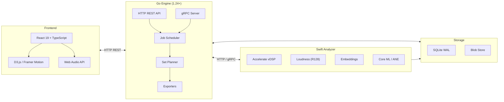

<div align="center">


# Algiers — DJ Set Prep Copilot

**Apple Silicon–native DJ prep tool: analyze, cue, transition, export — all local.**

<!-- Status & Version -->
[](#beta-features)
[](#changelog)
[](#what-this-is)
[](#what-this-is)
[](#why-its-different)

<!-- Apple Silicon Platform -->
[](#apple-silicon-only)
[](#apple-silicon-only)
[](#hardware-acceleration-m1-m5)
[](#hardware-acceleration-m1-m5)
[](#hardware-acceleration-m1-m5)
[](#hardware-acceleration-m1-m5)

<!-- Backend Stack -->
[](#architecture)
[](#architecture)
[](#communication-protocols)
[](#communication-protocols)
[](#architecture)
[](#architecture)

<!-- Frontend Stack -->
[](#architecture)
[](#architecture)
[](#architecture)
[](#web-audio-playback)
[](#pro-visualizations)
[](#pro-visualizations)
[](#pro-visualizations)

<!-- Audio Formats -->
[](#feature-highlights)
[](#feature-highlights)
[](#feature-highlights)
[](#feature-highlights)
[](#feature-highlights)
[](#feature-highlights)

<!-- Quality & Docs -->
[](#developer-loop)
[](docs/API.md)
[](LICENSE)

<br/>

### See it in action


**100% local. No cloud. ANE + Metal accelerated. Private by design.**

</div>

---

## Table of Contents
- [What This Is](#what-this-is)
- [Beta Features](#beta-features)
- [Pro Visualizations](#pro-visualizations)
- [Why It's Different](#why-its-different)
- [Apple Silicon Only](#apple-silicon-only)
- [Hardware Acceleration (M1–M5)](#hardware-acceleration-m1-m5)
- [Feature Highlights](#feature-highlights)
- [Architecture](#architecture)
- [Communication Protocols](#communication-protocols)
- [Screenshots](#screenshots)
- [Quick Start](#quick-start)
- [Developer Loop](#developer-loop)
- [Project Layout](#project-layout)
- [Roadmap](#roadmap)
- [API Reference](#api-reference)
- [Contributing](#contributing)
- [License](#license)

## What This Is

A local-first copilot for DJ set prep. It ingests your library, detects structure, surfaces mixable sections, proposes cue points and transition windows, and optimizes set order with explainable scoring—while keeping you in control of the mix.

**Key Principles:**
- End-to-end local: no cloud lock-in; audio never leaves your Mac
- Apple-accelerated DSP: tempo, key, loudness, and energy analysis run on Metal + Accelerate
- AI where it helps: ANE-powered models suggest cues/sections but every choice is editable
- Explainable transitions: every proposed segue cites tempo delta, key distance, energy window overlap, and beat-grid alignment
- Vibe continuity: 128-dimensional audio embeddings find tracks that "feel" similar

## Beta Features

v0.3.0-beta brings professional audio analysis with broadcast-standard loudness measurement:

### Audio Analysis
- **EBU R128 Loudness** — Broadcast-standard loudness (LUFS, LU, true peak) with K-weighting filters
- **Audio Embeddings** — 128-dimensional vectors for "vibe" similarity matching
- **Spectral Features** — Centroid, rolloff, flatness, harmonic ratio for timbre analysis
- **Web Audio Playback** — Full browser-based audio with play/pause/seek/speed controls

### UI & Visualization
- **Live Dashboard** — Animated stats with real-time analysis progress, BPM/key distribution charts
- **Canvas Waveform Renderer** — High-performance waveform with section overlays, cue markers, playhead, and beat grid
- **Real-time Spectrum Analyzer** — WebGL-style frequency visualization with mirror mode
- **Set Energy Arc** — Animated SVG energy flow visualization across your set
- **Transition Graph** — D3.js force-directed graph showing track connections and flow
- **Three-View Layout** — Library, Set Builder, and Graph View modes
- **Dark Mode Default** — Pro-first dark theme with light mode toggle

### Export Formats
- **Rekordbox XML** — Full DJ_PLAYLISTS schema with cues, tempo markers, and key
- **Serato crate** — Binary .crate format with supplementary cues CSV
- **Traktor NML** — Complete NML v19 export with CUE_V2 markers
- **Generic** — M3U8, JSON, CSV, SHA256 checksums, tar.gz bundles

## Pro Visualizations

Built with high-performance libraries for smooth 60fps rendering:

| Component | Technology | Description |
|-----------|-----------|-------------|
| **Waveform Canvas** | Canvas 2D API | GPU-accelerated waveform with sections, cues, and beat markers |
| **Spectrum Analyzer** | Canvas 2D + RAF | Real-time frequency bars with mirror/bars/circular modes |
| **Energy Arc** | SVG + Framer Motion | Animated bezier curve showing set energy journey |
| **Transition Graph** | D3.js Force | Interactive force-directed graph with zoom/pan/drag |
| **BPM/Key Charts** | D3.js | Animated bar charts with hover tooltips |
| **Live Stats** | Framer Motion | Spring-animated number counters and progress rings |
| **Audio Player** | Web Audio API | Full playback with timeline, seek, speed control |

**Libraries Used:**
- **D3.js 7** — Data visualization and force simulation
- **Framer Motion 11** — Spring physics animations and gestures
- **React Virtuoso 4** — Virtualized list rendering (ready for large libraries)
- **Zustand 5** — Lightweight state management
- **Web Audio API** — Browser-native audio playback with AudioContext

## Why It's Different

| Feature | Algiers | Cloud-based Tools |
|---------|---------|-------------------|
| **Privacy** | Audio never leaves your Mac | Uploads to servers |
| **Speed** | ANE + Metal acceleration | Network latency |
| **Control** | Every edit is yours | AI decides for you |
| **Explainability** | Shows why transitions work | Black box |
| **Offline** | Works without internet | Requires connection |
| **Loudness** | Broadcast-standard EBU R128 | Inconsistent metering |
| **Similarity** | 128-dim embeddings for vibe matching | Genre tags only |

## Apple Silicon Only

- Built, tested, and tuned for **M1–M5** (M1, M1 Pro/Max/Ultra, M2, M3, M4)
- Assumes unified memory and ANE availability
- Fallback code paths removed to keep performance consistent
- Core ML targets the ANE by default; GPU (Metal) is a secondary path

## Hardware Acceleration (M1–M5)

| Engine | Use Case | Implementation |
|--------|----------|----------------|
| **ANE (Neural Engine)** | Section classification, energy models, downbeat confidence | Core ML with ANE preference |
| **Metal (GPU)** | Real-time spectrograms, onset detection, waveform tiling | Metal Performance Shaders |
| **Accelerate (vDSP/BLAS)** | FFT, K-weighting, beatgrid, key detection, embeddings | Vectorized SIMD operations |
| **Unified Memory** | Zero-copy data sharing between CPU/GPU/ANE | Chunked streaming pipelines |

## Feature Highlights

### Library Management
- Resumable library ingest (WAV/AIFF/MP3/AAC/ALAC/FLAC)
- Content-hash caching for instant re-scans
- "Needs review" flagging for low-confidence analysis
- Search by title, artist, or key

### Analysis
- **Beatgrid** — Static + dynamic tempo maps with confidence scoring
- **Key Detection** — Krumhansl-Schmuckler with Camelot wheel mapping
- **Energy** — 1-10 scale with per-section curves and band breakdown (low/mid/high)
- **Loudness** — EBU R128 integrated, momentary, short-term, loudness range, true peak
- **Sections** — Intro/Verse/Build/Drop/Breakdown/Outro with confidence
- **Cues** — Up to 8 beat-aligned suggestions with priority scoring
- **Embeddings** — 128-dimensional similarity vectors for vibe matching

### Set Planning
- Weighted graph optimization with explainable scoring
- Set modes: Warm-up, Peak-time, Open-format
- Edge explanations: tempo delta, key relation, energy flow
- Transition window matching (intro→outro overlap)
- **Vibe continuity** scoring using audio embeddings

### Export
- **Generic** — M3U8, JSON, CSV, SHA256 checksums, tar.gz bundles
- **Rekordbox** — Full DJ_PLAYLISTS XML with cues, tempo markers, key
- **Serato** — Binary .crate format with cues CSV
- **Traktor** — NML v19 with CUE_V2 markers

### Web Audio Playback
- Browser-native audio with AudioContext and AudioBufferSourceNode
- Play/pause/stop/seek controls
- Variable playback speed (0.5x – 1.5x)
- Timeline with draggable playhead
- Synced with waveform visualization

## Architecture

Algiers uses a three-layer architecture optimized for Apple Silicon:



**How it works:**

1. **Frontend** — React UI sends commands via HTTP REST (scan library, plan set, export)
2. **Go Engine** — Coordinates jobs, runs the weighted-graph set planner, handles exports
3. **Swift Analyzer** — DSP analysis using Apple frameworks (Accelerate, Metal, Core ML)
4. **Storage** — SQLite for metadata, blob store for waveform tiles and embeddings

| Layer | Tech | Role |
|-------|------|------|
| **Frontend** | React 19, TypeScript, Vite, D3.js, Web Audio | Interactive UI with audio playback |
| **Engine** | Go 1.24, HTTP/gRPC, Protobuf | API server, job scheduling, set planning |
| **Analyzer** | Swift 6, Accelerate, Metal, Core ML | Audio DSP, loudness, embeddings |
| **Storage** | SQLite (WAL mode) | Track metadata, analysis results |

## Communication Protocols

### Why HTTP REST (Current)

The web UI and Swift analyzer currently use **HTTP REST** for communication:

```
┌─────────┐       HTTP/JSON        ┌──────────┐       HTTP/JSON       ┌────────────┐
│ Web UI  │ ◄──────────────────► │ Go Engine│ ◄───────────────────► │Swift Analzr│
│ (React) │    /api/tracks         │  (Go)    │    /analyze           │  (Swift)   │
└─────────┘    /api/export         └──────────┘    /health             └────────────┘
```

**Advantages of HTTP REST:**
- **Simplicity** — Easy to debug with curl, browser DevTools, Postman
- **Browser-native** — No additional libraries needed (fetch API)
- **Firewall-friendly** — Works on port 80/443 without special configuration
- **Human-readable** — JSON responses are easy to inspect and log
- **Quick iteration** — Faster to prototype without code generation

### Why gRPC (Future)

gRPC is planned for production deployments with high-throughput requirements:

```
┌─────────┐      gRPC-web          ┌──────────┐        gRPC          ┌────────────┐
│ Web UI  │ ◄──────────────────► │ Go Engine│ ◄───────────────────► │Swift Analzr│
│ (React) │   binary protobuf     │  (Go)    │    binary protobuf    │  (Swift)   │
└─────────┘   multiplexed         └──────────┘    streaming          └────────────┘
```

**Advantages of gRPC:**
- **Performance** — Binary protobuf is 3-10x smaller than JSON
- **Streaming** — Native support for real-time progress updates
- **Type Safety** — Generated stubs catch errors at compile time
- **Multiplexing** — Multiple RPC calls over one HTTP/2 connection
- **Bi-directional** — Server can push updates without polling

### Protocol Comparison

| Aspect | HTTP REST | gRPC |
|--------|-----------|------|
| **Encoding** | JSON (text) | Protobuf (binary) |
| **Size** | ~3-10x larger | Compact |
| **Latency** | HTTP/1.1 connection per request | HTTP/2 multiplexed |
| **Streaming** | Polling or WebSocket | Native bi-directional |
| **Browser** | Native fetch | Requires gRPC-web proxy |
| **Debugging** | Easy (curl, DevTools) | Needs specialized tools |
| **Code Gen** | Optional | Required |
| **Best For** | Web apps, rapid prototyping | Microservices, high throughput |

### Current Implementation

The codebase supports both protocols:

```go
// HTTP REST (internal/httpapi/)
router.POST("/api/analyze", handleAnalyze)
router.GET("/api/tracks", handleListTracks)
router.POST("/api/export/rekordbox", handleExportRekordbox)

// gRPC (internal/server/)
func (s *EngineServer) AnalyzeTrack(ctx context.Context, req *pb.AnalyzeRequest) (*pb.TrackAnalysis, error)
func (s *EngineServer) ProposeSet(ctx context.Context, req *pb.ProposeSetRequest) (*pb.SetPlan, error)
```

The Swift analyzer exposes both:
```bash
# HTTP (current - simple, works everywhere)
./analyzer-swift serve --port 9090 --proto http

# gRPC (future - for high-throughput pipelines)
./analyzer-swift serve --port 9090 --proto grpc
```

**Recommendation:** Use HTTP REST for development and simple deployments. Switch to gRPC when you need streaming progress updates or are processing large libraries (1000+ tracks).

## Detailed Architecture

### Swift Analyzer Pipeline

The Swift analyzer (`analyzer-swift`) is the core audio analysis engine, built with Apple's Accelerate framework for high-performance DSP on Apple Silicon.

```
┌─────────────────────────────────────────────────────────────────────────┐
│                        Swift Analyzer Pipeline                           │
├─────────────────────────────────────────────────────────────────────────┤
│                                                                          │
│  ┌──────────────┐    ┌──────────────┐    ┌──────────────┐               │
│  │ AudioDecoder │───▶│ FFTProcessor │───▶│   Analysis   │               │
│  │ (AVFoundation)│    │ (Accelerate) │    │   Modules    │               │
│  └──────────────┘    └──────────────┘    └──────────────┘               │
│         │                   │                    │                       │
│         ▼                   ▼                    ▼                       │
│   ┌──────────┐       ┌──────────┐        ┌─────────────┐                │
│   │ 48kHz SR │       │  STFT    │        │ BeatgridDet │                │
│   │ Mono PCM │       │ Spectral │        │ KeyDetector │                │
│   │ Float32  │       │  Flux    │        │ EnergyAnalz │                │
│   └──────────┘       │ Chroma   │        │ LoudnessAnl │◄── EBU R128    │
│                      └──────────┘        │ EmbeddingGn │◄── 128-dim     │
│                                          │ SectionDet  │                │
│                                          │ CueGenerator│                │
│                                          └─────────────┘                │
│                                                 │                        │
│                                                 ▼                        │
│                                    ┌────────────────────┐               │
│                                    │ TrackAnalysisResult │               │
│                                    │  - beats, tempoMap  │               │
│                                    │  - key (Camelot)    │               │
│                                    │  - energy, loudness │               │
│                                    │  - embedding (128d) │               │
│                                    │  - sections, cues   │               │
│                                    └────────────────────┘               │
│                                                                          │
└─────────────────────────────────────────────────────────────────────────┘
```

#### DSP Components

| Component | Framework | Description |
|-----------|-----------|-------------|
| **AudioDecoder** | AVFoundation | Decodes WAV/MP3/AAC/FLAC to 48kHz mono PCM |
| **FFTProcessor** | Accelerate vDSP | FFT with Hann windowing, STFT, spectral flux, chroma features |
| **BeatgridDetector** | Accelerate | Onset detection via spectral flux + autocorrelation tempo estimation |
| **KeyDetector** | Accelerate | Krumhansl-Schmuckler key profiles with chroma correlation |
| **EnergyAnalyzer** | Accelerate | RMS/peak analysis, band energy (low/mid/high), energy curve |
| **LoudnessAnalyzer** | Accelerate | EBU R128 with K-weighting, integrated/momentary/short-term loudness |
| **EmbeddingGenerator** | Accelerate | 128-dim MFCC-like features for similarity matching |
| **SectionDetector** | — | Energy segmentation for intro/verse/build/drop/breakdown/outro |
| **CueGenerator** | — | Priority-based cue selection with beat alignment (max 8 cues) |

#### Loudness Analysis (EBU R128)

Broadcast-standard loudness measurement per ITU-R BS.1770-4:

```
1. Apply K-weighting filters (high shelf + high-pass)
2. Calculate mean square of K-weighted samples
3. Compute loudness in 400ms blocks (momentary)
4. Compute loudness in 3s blocks (short-term)
5. Gate blocks below -70 LUFS (absolute)
6. Gate blocks below relative threshold (-10 LU from ungated)
7. Average gated blocks → Integrated Loudness (LUFS)
8. Calculate Loudness Range (LRA) from short-term distribution
9. Measure true peak via 4x oversampling
```

Output:
- **Integrated Loudness** — Overall loudness in LUFS (typical: -14 to -8 LUFS for music)
- **Loudness Range** — Dynamic range in LU (typical: 4-12 LU for electronic music)
- **Momentary Max** — Peak 400ms loudness
- **Short-term Max** — Peak 3s loudness
- **True Peak** — Maximum inter-sample peak in dBTP

#### Audio Embeddings

128-dimensional vectors for finding tracks with similar "vibe":

```
1. Compute STFT spectrogram (2048-point FFT, 1024-sample hop)
2. Divide spectrum into 32 mel-like bands
3. For each band, compute:
   - Mean magnitude
   - Standard deviation
   - Delta (first derivative)
   - Delta-delta (second derivative)
4. Concatenate → 128 dimensions (32 bands × 4 stats)
5. L2 normalize for cosine similarity
```

Similarity metrics:
- **Cosine Similarity** — Pure vector similarity (0-1)
- **Vibe Similarity** — Weighted combination:
  - 50% vector similarity
  - 15% spectral centroid (brightness)
  - 15% spectral flatness (tonal vs noisy)
  - 10% harmonic ratio
  - 10% zero crossing rate (percussiveness)

### Go Engine Architecture

The Go engine handles coordination, storage, and exports.

```
┌─────────────────────────────────────────────────────────────────────────┐
│                          Go Engine (1.24+)                               │
├─────────────────────────────────────────────────────────────────────────┤
│                                                                          │
│  ┌─────────────────┐    ┌─────────────────┐    ┌──────────────────┐    │
│  │   HTTP API      │    │   gRPC Server   │    │  Library Scanner │    │
│  │ /api/tracks     │    │ EngineService   │    │ (recursive, hash) │    │
│  │ /api/export     │    │ AnalyzerWorker  │    └──────────────────┘    │
│  │ /api/propose-set│    │                 │                             │
│  └─────────────────┘    └─────────────────┘                             │
│           │                     │                                        │
│           ▼                     ▼                                        │
│  ┌─────────────────────────────────────────────────────────────────┐   │
│  │                       Set Planner                                │   │
│  │  - Weighted graph with edge scoring                             │   │
│  │  - Key compatibility (Camelot wheel distance)                    │   │
│  │  - Tempo delta penalty                                           │   │
│  │  - Energy flow scoring (climb/drop preferences)                  │   │
│  │  - Vibe similarity from embeddings                              │   │
│  │  - Transition window overlap detection                           │   │
│  │  - Set modes: Warm-up, Peak-time, Open-format                   │   │
│  └─────────────────────────────────────────────────────────────────┘   │
│                                    │                                     │
│                                    ▼                                     │
│  ┌─────────────────────────────────────────────────────────────────┐   │
│  │                        Exporters                                 │   │
│  │  ┌──────────┐ ┌──────────┐ ┌──────────┐ ┌──────────┐           │   │
│  │  │ Generic  │ │ Rekordbox│ │  Serato  │ │ Traktor  │           │   │
│  │  │ M3U/JSON │ │   XML    │ │  .crate  │ │   NML    │           │   │
│  │  │ CSV/Tar  │ │DJ_PLAYLIST│ │ vrsn fmt │ │  v19     │           │   │
│  │  └──────────┘ └──────────┘ └──────────┘ └──────────┘           │   │
│  └─────────────────────────────────────────────────────────────────┘   │
│                                                                          │
└─────────────────────────────────────────────────────────────────────────┘
```

### Web UI Architecture

React 19 + TypeScript with Zustand state management and Web Audio.

```
┌─────────────────────────────────────────────────────────────────────────┐
│                      Web UI (React 19 + TypeScript)                      │
├─────────────────────────────────────────────────────────────────────────┤
│                                                                          │
│  ┌─────────────────────────────────────────────────────────────────┐   │
│  │                    Zustand Store (store.ts)                      │   │
│  │  - tracks, trackMap, filteredTracks                             │   │
│  │  - selectedId, viewMode, chartMode                              │   │
│  │  - currentSetPlan with edges                                    │   │
│  │  - isPlaying, playheadPosition (audio sync)                     │   │
│  │  - API actions: fetchTracks, proposeSet, exportSet             │   │
│  └─────────────────────────────────────────────────────────────────┘   │
│                                    │                                     │
│           ┌────────────────────────┼────────────────────────┐           │
│           ▼                        ▼                        ▼           │
│  ┌────────────────┐     ┌────────────────┐     ┌────────────────┐      │
│  │  Library View  │     │  Set Builder   │     │   Graph View   │      │
│  │  - LibraryGrid │     │  - SetBuilder  │     │ - TransitionGr │      │
│  │  - TrackDetail │     │  - EnergyArc   │     │ - D3 force sim │      │
│  │  - AudioPlayer │     │  - ExportPanel │     │ - zoom/pan     │      │
│  │  - BPMKeyChart │     └────────────────┘     └────────────────┘      │
│  └────────────────┘                                                     │
│                                                                          │
│  ┌─────────────────────────────────────────────────────────────────┐   │
│  │                    Audio Playback (Web Audio)                    │   │
│  │  ┌──────────────┐ ┌──────────────┐ ┌──────────────┐             │   │
│  │  │ AudioContext │ │BufferSource  │ │  GainNode    │             │   │
│  │  │ (singleton)  │ │ (per track)  │ │ (volume)     │             │   │
│  │  └──────────────┘ └──────────────┘ └──────────────┘             │   │
│  │  ┌──────────────────────────────────────────────────────────┐   │   │
│  │  │ useAudioPlayer hook                                       │   │   │
│  │  │  - loadTrack(url), play(), pause(), stop(), seek(time)   │   │   │
│  │  │  - setPlaybackRate(0.5-1.5x)                              │   │   │
│  │  │  - state: isPlaying, currentTime, duration, error         │   │   │
│  │  └──────────────────────────────────────────────────────────┘   │   │
│  └─────────────────────────────────────────────────────────────────┘   │
│                                                                          │
│  ┌─────────────────────────────────────────────────────────────────┐   │
│  │                    Visualization Components                      │   │
│  │  ┌──────────────┐ ┌──────────────┐ ┌──────────────┐             │   │
│  │  │WaveformCanvas│ │SpectrumAnalz│ │  EnergyArc   │             │   │
│  │  │ Canvas 2D    │ │ Canvas 2D   │ │ SVG + Framer │             │   │
│  │  │ sections     │ │ mirror/bars │ │ bezier curve │             │   │
│  │  │ cues, beats  │ │ 60fps RAF   │ │ spring anim  │             │   │
│  │  │ playhead sync│ │             │ │              │             │   │
│  │  └──────────────┘ └──────────────┘ └──────────────┘             │   │
│  └─────────────────────────────────────────────────────────────────┘   │
│                                                                          │
└─────────────────────────────────────────────────────────────────────────┘
```

### Data Flow

```
┌──────────┐     ┌──────────┐     ┌──────────┐     ┌──────────┐
│  Audio   │────▶│  Swift   │────▶│   Go     │────▶│   Web    │
│  Files   │     │ Analyzer │     │  Engine  │     │   UI     │
└──────────┘     └──────────┘     └──────────┘     └──────────┘
     │                │                 │                │
     │                │                 │                │
     ▼                ▼                 ▼                ▼
┌──────────┐     ┌──────────┐     ┌──────────┐     ┌──────────┐
│WAV/MP3/  │     │TrackAnalz│     │ SQLite   │     │ Zustand  │
│AAC/FLAC  │     │+ Loudness│     │ + Blobs  │     │ + Audio  │
│          │     │+ Embedng │     │          │     │ Context  │
└──────────┘     └──────────┘     └──────────┘     └──────────┘

1. Library Scanner finds audio files, computes SHA256 content hash
2. Swift Analyzer decodes audio, runs DSP pipeline:
   - Beatgrid, key, energy, loudness, embedding, sections, cues
3. Analysis results stored in SQLite with WAL mode
4. Web UI fetches via HTTP API, stores in Zustand
5. User can preview tracks with Web Audio playback
6. User builds set, UI calls proposeSet API
7. Planner returns ordered tracks with edge explanations
   - Uses embedding similarity for vibe continuity
8. Export generates Rekordbox/Serato/Traktor files
```

## Screenshots

| Library View | Set Builder | Graph View |
|:---:|:---:|:---:|
|  |  |  |

<details>
<summary>More screenshots</summary>

| Active Waveform | Light Mode |
|:---:|:---:|
|  |  |

</details>

## Quick Start

### Prerequisites

- **macOS 13+** (Ventura or later)
- **Apple Silicon** (M1/M2/M3/M4)
- **Go 1.24+** — `brew install go`
- **Node.js 22+** — `brew install node`
- **Swift 6+** — Comes with Xcode Command Line Tools

### Build & Run

```bash
# Clone the repository
git clone https://github.com/cartomix/algiers.git
cd algiers

# 1. Build the Swift analyzer (required for audio analysis)
cd analyzer-swift
swift build -c release
cd ..

# 2. Install dependencies
go mod download
cd web && npm install && cd ..

# 3. Start all services (3 terminals)

# Terminal 1: Start the Go engine (port 50051 gRPC, 8080 HTTP)
go run ./cmd/engine

# Terminal 2: Start the Swift analyzer (port 9090)
./analyzer-swift/.build/release/analyzer-swift serve --port 9090

# Terminal 3: Start the web UI (port 5173)
cd web && npm run dev
```

Open http://localhost:5173 to see the UI.

### Analyze a Single Track

```bash
# Analyze and print JSON (includes loudness + embedding)
./analyzer-swift/.build/release/analyzer-swift "path/to/track.flac"

# Show summary with loudness info
./analyzer-swift/.build/release/analyzer-swift --format summary "path/to/track.flac"

# Example output:
# Track: path/to/track.flac
# Duration: 369.6s
# BPM: 117.2 (confidence: 100%)
# Key: F# / 2B (confidence: 92%)
# Energy: 7/10
# Loudness: -14.0 LUFS (range: 3.7 LU, peak: 0.5 dBTP)
# Sections: 7
# Cues: 8
# Embedding: 128-dim vector (centroid: 628 Hz)

# Show progress during analysis
./analyzer-swift/.build/release/analyzer-swift --progress "path/to/track.flac"
```

### Test Corpus Setup

For testing with real audio files:

```bash
# Create test directory
mkdir -p testdata/real-audio

# Copy your test tracks (FLAC, MP3, WAV, AIFF, AAC, ALAC supported)
cp ~/Music/*.flac testdata/real-audio/

# Create a MANIFEST.md to document your test corpus
# (see testdata/real-audio/MANIFEST.md for example)
```

Note: Audio files in `testdata/real-audio/` are gitignored.

## Developer Loop

| Command | Description |
|---------|-------------|
| `make test` | Run Go + Swift unit tests |
| `make lint` | Run golangci-lint, swift-format, eslint |
| `make proto` | Regenerate protobuf stubs |
| `make fixturegen` | Generate test audio fixtures |
| `make build` | Build engine + analyzer binaries |
| `cd web && npm run dev` | Start Vite dev server |
| `cd web && npm run build` | Production build |
| `make screenshots-install` | Install Playwright browsers |
| `make screenshots` | Capture UI screenshots (headless) |
| `make screenshots-headed` | Capture UI screenshots (visible browser) |

### Test Fixtures

```bash
make fixturegen
```

Generates deterministic WAV files under `testdata/audio/`:
- BPM ladder (80–160 BPM click tracks)
- Swing click (52-65% swing ratios)
- Tempo ramp (128→100 BPM linear)
- Harmonic pad (chord in known keys)
- `manifest.json` for golden comparisons

### Real Audio Test Corpus

For testing with real music (not committed to git):

```bash
# Create test directory and copy tracks from your library
mkdir -p testdata/real-audio

# Analyze with Swift analyzer
./analyzer-swift/.build/release/analyzer-swift analyze testdata/real-audio/*.flac --progress

# Or scan with Go engine
go run ./cmd/engine scan testdata/real-audio/
```

A sample corpus is documented in `testdata/real-audio/MANIFEST.md` with tracks from:
- **Daft Punk** - Dance (88.2kHz/24-bit)
- **Khruangbin** - Dub (96kHz/24-bit)
- **Masego** - Neo-soul (44.1kHz/16-bit)
- **Michael Kiwanuka** - Soul (96kHz/24-bit)
- **Bill Withers** - Classic Soul (44.1kHz/16-bit)

Audio files are gitignored. Copy your own tracks to test.

### Export Verification

```bash
go run ./cmd/exportverify --manifest <path>/checksums.txt
```

Validates SHA256 checksums for exported bundles.

### Screenshot & GIF Capture

Automated screenshot and GIF capture using Playwright-Go for README assets.

```bash
# One-time: Install Playwright browsers + ffmpeg
make screenshots-install
brew install ffmpeg  # for GIF conversion

# Start the web UI (in a separate terminal)
make run-web

# Capture screenshots + animated GIF
make screenshots

# Or watch the browser (useful for debugging)
make screenshots-headed
```

**Output files:**
- `algiers-demo.gif` — Animated hero for README
- `algiers-library-view.png` — Library view
- `algiers-set-builder.png` — Set Builder
- `algiers-graph-view.png` — Transition graph
- `algiers-light-mode.png` — Light mode

Screenshots at 1280x720 @2x (retina). GIF at 640px width, 12fps.

## Project Layout

```
.
├── cmd/
│   ├── engine/          # Go gRPC/HTTP server entrypoint
│   ├── exportverify/    # Checksum verification CLI
│   ├── fixturegen/      # Test audio generator
│   └── screenshots/     # Playwright-Go screenshot capture
├── analyzer-swift/      # Swift analyzer module (Metal + Core ML)
│   ├── Package.swift
│   └── Sources/
│       ├── AnalyzerSwift/
│       │   ├── Analysis/
│       │   │   ├── BeatgridDetector.swift
│       │   │   ├── KeyDetector.swift
│       │   │   ├── EnergyAnalyzer.swift
│       │   │   ├── LoudnessAnalyzer.swift  # EBU R128
│       │   │   ├── EmbeddingGenerator.swift # 128-dim vibe vectors
│       │   │   ├── SectionDetector.swift
│       │   │   └── CueGenerator.swift
│       │   ├── DSP/
│       │   │   ├── AudioDecoder.swift
│       │   │   └── FFT.swift
│       │   └── Analyzer.swift
│       └── AnalyzerServer/
│           └── main.swift           # CLI + HTTP server
├── internal/
│   ├── analyzer/        # Analyzer interface + gRPC client
│   ├── auth/            # gRPC auth interceptors
│   ├── config/          # Server configuration
│   ├── exporter/        # M3U/JSON/CSV/Tar + vendor exports
│   │   ├── rekordbox.go # Rekordbox XML
│   │   ├── serato.go    # Serato crate
│   │   └── traktor.go   # Traktor NML
│   ├── fixtures/        # WAV generator
│   ├── httpapi/         # HTTP REST endpoints
│   ├── planner/         # Set ordering algorithm
│   ├── scanner/         # Library file scanner
│   ├── server/          # gRPC server implementation
│   └── storage/         # SQLite + blob store
├── web/
│   ├── src/
│   │   ├── components/  # React components
│   │   │   ├── AudioPlayer.tsx      # Web Audio controls
│   │   │   ├── WaveformCanvas.tsx
│   │   │   ├── SpectrumAnalyzer.tsx
│   │   │   ├── EnergyArc.tsx
│   │   │   ├── TransitionGraph.tsx
│   │   │   ├── LiveStats.tsx
│   │   │   ├── BPMKeyChart.tsx
│   │   │   ├── ExportPanel.tsx
│   │   │   └── ...
│   │   ├── hooks/
│   │   │   └── useAudioPlayer.ts    # Web Audio hook
│   │   ├── api.ts                   # API client
│   │   ├── store.ts                 # Zustand store
│   │   ├── App.tsx
│   │   └── types.ts
│   └── package.json
├── proto/               # gRPC/Protobuf contracts
├── gen/go/              # Generated Go stubs
├── docs/
│   ├── API.md           # API reference
│   ├── PLAN.md          # Milestones and tasks
│   └── ROADMAP.md       # Ops hardening checklist
├── testdata/audio/      # Generated test fixtures
└── Makefile
```

## Roadmap

### Alpha (Complete)
- [x] gRPC engine with health checks
- [x] Library scanner with content hashing
- [x] SQLite storage with migrations
- [x] Set planner with weighted graph
- [x] Generic exports (M3U/JSON/CSV/Tar)
- [x] Pro UI with visualizations
- [x] Dark mode default

### Beta (Complete)
- [x] Swift analyzer with Accelerate DSP
- [x] Beatgrid detection (onset + autocorrelation)
- [x] Key detection with Camelot/Open Key mapping
- [x] Energy analysis with band breakdown
- [x] **Loudness analysis (EBU R128 + true peak)**
- [x] **Audio embeddings (128-dim similarity vectors)**
- [x] Section detection (intro/verse/build/drop/breakdown/outro)
- [x] Cue generation (priority-based, beat-aligned)
- [x] HTTP REST API bridge for web UI
- [x] Zustand state management with API integration
- [x] **Web Audio playback with AudioPlayer component**
- [x] Export panel in Set Builder UI
- [x] Rekordbox XML export
- [x] Serato crate export
- [x] Traktor NML export
- [x] Playwright-Go E2E tests
- [x] API documentation

### v1.0 (In Progress)
- [ ] Core ML integration for ANE inference
- [ ] gRPC streaming for real-time progress
- [ ] Vibe-based set ordering using embeddings
- [ ] Alpha acceptance: 100 tracks → 30-track set → export

## API Reference

See [docs/API.md](docs/API.md) for complete API documentation including:
- Swift Analyzer CLI commands
- HTTP REST endpoints
- gRPC service definitions
- Data type schemas
- Error handling

## Contributing

PRs welcome! Keep commits scoped and include:
- Repro steps for bugs
- Expected vs actual behavior
- Test coverage for new features

## Changelog

### v0.3.0-beta (2026-01-29)
- **Loudness Analysis (EBU R128)**
  - K-weighting filters per ITU-R BS.1770-4
  - Integrated, momentary, short-term loudness (LUFS)
  - Loudness range (LU) and true peak (dBTP)
- **Audio Embeddings for Vibe Matching**
  - 128-dimensional MFCC-like vectors
  - Spectral centroid, rolloff, flatness, harmonic ratio
  - Cosine similarity and weighted vibe similarity
- **Web Audio Playback Integration**
  - AudioPlayer component with play/pause/stop/seek
  - Variable playback speed (0.5x–1.5x)
  - Timeline with draggable playhead
  - Synced with waveform visualization
- **Documentation**
  - API reference (docs/API.md)
  - Updated quickstart with prerequisites
  - gRPC vs HTTP protocol explanation

### v0.2.0-beta (2026-01-29)
- **Swift Analyzer with Accelerate DSP** (full implementation)
  - AudioDecoder using AVFoundation with sample rate conversion
  - FFTProcessor with vDSP: STFT, spectral flux, chroma features
  - BeatgridDetector: onset detection + autocorrelation tempo estimation
  - KeyDetector: Krumhansl-Schmuckler profiles with Camelot/Open Key output
  - EnergyAnalyzer: RMS/peak, band energy (low/mid/high), energy curve
  - SectionDetector: energy-based segmentation (intro/verse/build/drop/breakdown/outro)
  - CueGenerator: priority-based selection with beat alignment (max 8 cues)
  - Main Analyzer orchestrator with async progress callbacks
  - CLI tool (`analyzer-swift analyze/serve/healthcheck`)
  - HTTP API server for analyzer integration
- Web Audio playback hook (useAudioPlayer) with play/pause/seek
- Golden comparison tests for all export formats
- Detailed architecture documentation in README

### v0.1.1-alpha (2026-01-29)
- HTTP REST API bridge for web UI integration
- Zustand state management with API fallback to demo mode
- Export panel in Set Builder with vendor format selection
- Rekordbox XML export (DJ_PLAYLISTS schema)
- Serato crate export (.crate binary format)
- Traktor NML export (v19 schema with CUE_V2)
- Playwright-Go E2E test framework
- Property tests for planner algorithms

### v0.1.0-alpha (2026-01-29)
- Initial alpha release
- Pro UI with D3.js visualizations
- Canvas waveform renderer
- Real-time spectrum analyzer
- Energy arc and transition graph
- Live stats dashboard
- 16 demo tracks with realistic analysis
- Dark mode default

## License

Blue Oak Model License 1.0.0. See [LICENSE](LICENSE).

---

<div align="center">

**Built for DJs who want to prep smarter, not harder.**

Made with Metal, Core ML, and too much coffee.

</div>
