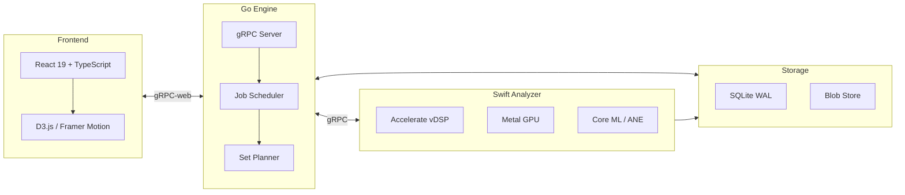

<div align="center">


# Algiers — DJ Set Prep Copilot

**Apple Silicon–native DJ prep tool: analyze, cue, transition, export — all local.**

<!-- Status & Version -->
[](#alpha-features)
[](#changelog)
[](#what-this-is)
[](#what-this-is)
[](#why-its-different)

<!-- Apple Silicon Platform -->
[](#apple-silicon-only)
[](#apple-silicon-only)
[](#hardware-acceleration-m1-m5)
[](#hardware-acceleration-m1-m5)
[](#hardware-acceleration-m1-m5)
[](#hardware-acceleration-m1-m5)

<!-- Backend Stack -->
[](#architecture)
[](#architecture)
[](#architecture)
[](#architecture)
[](#architecture)

<!-- Frontend Stack -->
[](#architecture)
[](#architecture)
[](#architecture)
[](#pro-visualizations)
[](#pro-visualizations)
[](#pro-visualizations)

<!-- Audio Formats -->
[](#feature-highlights)
[](#feature-highlights)
[](#feature-highlights)
[](#feature-highlights)
[](#feature-highlights)
[](#feature-highlights)

<!-- Quality & Docs -->
[](#developer-loop)
[](docs/PLAN.md)
[](LICENSE)

<br/>

### See it in action


**100% local. No cloud. ANE + Metal accelerated. Private by design.**

</div>

---

## Table of Contents
- [What This Is](#what-this-is)
- [Alpha Features](#alpha-features)
- [Pro Visualizations](#pro-visualizations)
- [Why It's Different](#why-its-different)
- [Apple Silicon Only](#apple-silicon-only)
- [Hardware Acceleration (M1–M5)](#hardware-acceleration-m1-m5)
- [Feature Highlights](#feature-highlights)
- [Architecture](#architecture)
- [Screenshots](#screenshots)
- [Quick Start](#quick-start)
- [Developer Loop](#developer-loop)
- [Project Layout](#project-layout)
- [Roadmap](#roadmap)
- [Contributing](#contributing)
- [License](#license)

## What This Is

A local-first copilot for DJ set prep. It ingests your library, detects structure, surfaces mixable sections, proposes cue points and transition windows, and optimizes set order with explainable scoring—while keeping you in control of the mix.

**Key Principles:**
- End-to-end local: no cloud lock-in; audio never leaves your Mac
- Apple-accelerated DSP: tempo, key, and energy analysis run on Metal + Accelerate
- AI where it helps: ANE-powered models suggest cues/sections but every choice is editable
- Explainable transitions: every proposed segue cites tempo delta, key distance, energy window overlap, and beat-grid alignment

## Alpha Features

v0.1.0-alpha brings the first complete UI with professional-grade visualizations:

- **Live Dashboard** — Animated stats with real-time analysis progress, BPM/key distribution charts
- **Canvas Waveform Renderer** — High-performance waveform with section overlays, cue markers, playhead, and beat grid
- **Real-time Spectrum Analyzer** — WebGL-style frequency visualization with mirror mode
- **Set Energy Arc** — Animated SVG energy flow visualization across your set
- **Transition Graph** — D3.js force-directed graph showing track connections and flow
- **Three-View Layout** — Library, Set Builder, and Graph View modes
- **Dark Mode Default** — Pro-first dark theme with light mode toggle

## Pro Visualizations

Built with high-performance libraries for smooth 60fps rendering:

| Component | Technology | Description |
|-----------|-----------|-------------|
| **Waveform Canvas** | Canvas 2D API | GPU-accelerated waveform with sections, cues, and beat markers |
| **Spectrum Analyzer** | Canvas 2D + RAF | Real-time frequency bars with mirror/bars/circular modes |
| **Energy Arc** | SVG + Framer Motion | Animated bezier curve showing set energy journey |
| **Transition Graph** | D3.js Force | Interactive force-directed graph with zoom/pan/drag |
| **BPM/Key Charts** | D3.js | Animated bar charts with hover tooltips |
| **Live Stats** | Framer Motion | Spring-animated number counters and progress rings |

**Libraries Used:**
- **D3.js 7** — Data visualization and force simulation
- **Framer Motion 11** — Spring physics animations and gestures
- **React Virtuoso 4** — Virtualized list rendering (ready for large libraries)
- **Zustand 5** — Lightweight state management

## Why It's Different

| Feature | Algiers | Cloud-based Tools |
|---------|---------|-------------------|
| **Privacy** | Audio never leaves your Mac | Uploads to servers |
| **Speed** | ANE + Metal acceleration | Network latency |
| **Control** | Every edit is yours | AI decides for you |
| **Explainability** | Shows why transitions work | Black box |
| **Offline** | Works without internet | Requires connection |

## Apple Silicon Only

- Built, tested, and tuned for **M1–M5** (M1, M1 Pro/Max/Ultra, M2, M3, M4)
- Assumes unified memory and ANE availability
- Fallback code paths removed to keep performance consistent
- Core ML targets the ANE by default; GPU (Metal) is a secondary path

## Hardware Acceleration (M1–M5)

| Engine | Use Case | Implementation |
|--------|----------|----------------|
| **ANE (Neural Engine)** | Section classification, energy models, downbeat confidence | Core ML with ANE preference |
| **Metal (GPU)** | Real-time spectrograms, onset detection, waveform tiling | Metal Performance Shaders |
| **Accelerate (vDSP/BLAS)** | FFT for beatgrid, harmonic key detection | Vectorized SIMD operations |
| **Unified Memory** | Zero-copy data sharing between CPU/GPU/ANE | Chunked streaming pipelines |

## Feature Highlights

### Library Management
- Resumable library ingest (WAV/AIFF/MP3/AAC/ALAC/FLAC)
- Content-hash caching for instant re-scans
- "Needs review" flagging for low-confidence analysis
- Search by title, artist, or key

### Analysis
- Beatgrid detection (static + dynamic tempo maps)
- Key detection with Camelot wheel mapping
- Energy level (1-10) with per-section curves
- Section detection (Intro/Break/Build/Drop/Outro)
- Up to 8 cue suggestions per track with confidence scores

### Set Planning
- Weighted graph optimization with explainable scoring
- Set modes: Warm-up, Peak-time, Open-format
- Edge explanations: tempo delta, key relation, energy flow
- Transition window matching (intro→outro overlap)

### Export
- M3U8 playlist
- Analysis JSON with full track data
- Cues CSV with beat/time indices
- SHA256 checksum manifest
- Ready-to-share tar.gz bundles
- *Coming soon:* Rekordbox, Serato, Traktor formats

## Architecture

Algiers uses a three-layer architecture optimized for Apple Silicon:



**How it works:**

1. **Frontend** — React UI sends commands (scan library, plan set, export) via gRPC-web
2. **Go Engine** — Coordinates jobs, runs the weighted-graph set planner, handles exports
3. **Swift Analyzer** — Performs DSP analysis using Apple frameworks (Accelerate, Metal, Core ML)
4. **Storage** — SQLite for metadata, blob store for waveform tiles and embeddings

| Layer | Tech | Role |
|-------|------|------|
| **Frontend** | React 19, TypeScript, Vite, D3.js, Framer Motion | Interactive UI with real-time visualizations |
| **Engine** | Go 1.24, gRPC, Protobuf | API server, job scheduling, set planning, exports |
| **Analyzer** | Swift 6, Accelerate, Metal, Core ML | Audio DSP and ML inference on ANE/GPU |
| **Storage** | SQLite (WAL mode) | Track metadata, analysis results, waveform tiles |

## Screenshots

| Library View | Set Builder | Graph View |
|:---:|:---:|:---:|
|  |  |  |

<details>
<summary>More screenshots</summary>

| Active Waveform | Light Mode |
|:---:|:---:|
|  |  |

</details>

## Quick Start

```bash
# Clone the repository
git clone https://github.com/cartomix/algiers.git
cd algiers

# Install Go dependencies
go mod download

# Install web dependencies
cd web && npm install && cd ..

# Generate proto stubs (if modified)
make proto

# Run tests
make test

# Start the engine (port 50051)
go run ./cmd/engine

# Start the web UI (separate terminal)
cd web && npm run dev
```

Open http://localhost:5173 to see the UI.

## Developer Loop

| Command | Description |
|---------|-------------|
| `make test` | Run Go + Swift unit tests |
| `make lint` | Run golangci-lint, swift-format, eslint |
| `make proto` | Regenerate protobuf stubs |
| `make fixturegen` | Generate test audio fixtures |
| `make build` | Build engine + analyzer binaries |
| `cd web && npm run dev` | Start Vite dev server |
| `cd web && npm run build` | Production build |
| `make screenshots-install` | Install Playwright browsers |
| `make screenshots` | Capture UI screenshots (headless) |
| `make screenshots-headed` | Capture UI screenshots (visible browser) |

### Test Fixtures

```bash
make fixturegen
```

Generates deterministic WAV files under `testdata/audio/`:
- BPM ladder (80–160 BPM click tracks)
- Swing click (52-65% swing ratios)
- Tempo ramp (128→100 BPM linear)
- Harmonic pad (chord in known keys)
- `manifest.json` for golden comparisons

### Export Verification

```bash
go run ./cmd/exportverify --manifest <path>/checksums.txt
```

Validates SHA256 checksums for exported bundles.

### Screenshot & GIF Capture

Automated screenshot and GIF capture using Playwright-Go for README assets.

```bash
# One-time: Install Playwright browsers + ffmpeg
make screenshots-install
brew install ffmpeg  # for GIF conversion

# Start the web UI (in a separate terminal)
make run-web

# Capture screenshots + animated GIF
make screenshots

# Or watch the browser (useful for debugging)
make screenshots-headed
```

**Output files:**
- `algiers-demo.gif` — Animated hero for README
- `algiers-library-view.png` — Library view
- `algiers-set-builder.png` — Set Builder
- `algiers-graph-view.png` — Transition graph
- `algiers-light-mode.png` — Light mode

Screenshots at 1280x720 @2x (retina). GIF at 640px width, 12fps.

## Project Layout

```
.
├── cmd/
│   ├── engine/          # Go gRPC server entrypoint
│   ├── exportverify/    # Checksum verification CLI
│   ├── fixturegen/      # Test audio generator
│   └── screenshots/     # Playwright-Go screenshot capture
├── analyzer-swift/      # Swift analyzer module (Metal + Core ML)
│   ├── Package.swift
│   └── Sources/
├── internal/
│   ├── analyzer/        # Analyzer interface + gRPC client
│   ├── auth/            # gRPC auth interceptors
│   ├── config/          # Server configuration
│   ├── exporter/        # M3U/JSON/CSV/Tar exports
│   ├── fixtures/        # WAV generator
│   ├── planner/         # Set ordering algorithm
│   ├── scanner/         # Library file scanner
│   ├── server/          # gRPC server implementation
│   └── storage/         # SQLite + blob store
├── web/
│   ├── src/
│   │   ├── components/  # React components
│   │   │   ├── WaveformCanvas.tsx
│   │   │   ├── SpectrumAnalyzer.tsx
│   │   │   ├── EnergyArc.tsx
│   │   │   ├── TransitionGraph.tsx
│   │   │   ├── LiveStats.tsx
│   │   │   ├── BPMKeyChart.tsx
│   │   │   └── ...
│   │   ├── App.tsx
│   │   └── types.ts
│   └── package.json
├── proto/               # gRPC/Protobuf contracts
├── gen/go/              # Generated Go stubs
├── docs/
│   ├── PLAN.md          # Milestones and tasks
│   └── ROADMAP.md       # Ops hardening checklist
├── testdata/audio/      # Generated test fixtures
└── Makefile
```

## Roadmap

### Alpha (Current)
- [x] gRPC engine with health checks
- [x] Library scanner with content hashing
- [x] SQLite storage with migrations
- [x] Set planner with weighted graph
- [x] Generic exports (M3U/JSON/CSV/Tar)
- [x] Pro UI with visualizations
- [x] Dark mode default

### Beta (Next)
- [ ] Swift analyzer with Accelerate DSP
- [ ] Core ML integration for ANE inference
- [ ] Beatgrid detection algorithm
- [ ] Key detection with Camelot mapping
- [ ] Web Audio playback integration
- [ ] gRPC-web bridge for real data

### v1.0
- [ ] Rekordbox XML export
- [ ] Serato crate export
- [ ] Traktor NML export
- [ ] Playwright-Go E2E tests
- [ ] Alpha acceptance: 100 tracks → 30-track set → export

## Contributing

PRs welcome! Keep commits scoped and include:
- Repro steps for bugs
- Expected vs actual behavior
- Test coverage for new features

## Changelog

### v0.1.0-alpha (2026-01-29)
- Initial alpha release
- Pro UI with D3.js visualizations
- Canvas waveform renderer
- Real-time spectrum analyzer
- Energy arc and transition graph
- Live stats dashboard
- 16 demo tracks with realistic analysis
- Dark mode default

## License

Blue Oak Model License 1.0.0. See [LICENSE](LICENSE).

---

<div align="center">

**Built for DJs who want to prep smarter, not harder.**

Made with Metal, Core ML, and too much coffee.

</div>
