# DJ Set Prep Copilot

### Apple Silicon–Only DJ library brain for cueing, transitions, and set ordering

**Nothing ships to a cloud. Everything runs on your Mac’s ANE + Metal for fast, private analysis.**

---

## Table of contents
- [What this is](#what-this-is)
- [Why it’s different](#why-its-different)
- [Apple Silicon only](#apple-silicon-only)
- [Hardware acceleration (M1–M4)](#hardware-acceleration-m1-m4)
- [Feature highlights](#feature-highlights)
- [Architecture](#architecture)
- [Developer loop](#developer-loop)
- [Project layout](#project-layout)
- [Roadmap snapshot (2026-01-29)](#roadmap-snapshot-2026-01-29)
- [Contributing](#contributing)
- [License](#license)

## What this is
A local-first copilot for DJ set prep. It ingests your library, detects structure, surfaces mixable sections, proposes cue points and transition windows, and optimizes set order with explainable scoring—while keeping you in control of the mix.

## Why it’s different
- **End-to-end local**: no cloud lock‑in; audio never leaves your Mac.
- **Apple‑accelerated DSP**: tempo, key, and energy analysis run on Metal + Accelerate.
- **AI where it helps**: ANE-powered models suggest cues/sections but every choice is editable.
- **Explainable transitions**: every proposed segue cites tempo delta, key distance, energy window overlap, and beat‑grid alignment.
- **Rehearsal workflow**: dual‑deck preview with beat‑synced scrubbing and per‑candidate AB loops.

## Apple Silicon only
- Built, tested, and tuned for **M1–M4**. Intel Macs are not supported.
- Assumes unified memory and ANE availability; fallback code paths are removed to keep performance consistent.
- Core ML targets the ANE by default; GPU (Metal) is a secondary path for heavy FFTs and rendering.

## Hardware acceleration (M1–M4)
- **ANE (Core ML)**: on‑device models score sections, energy envelopes, and downbeat confidence without leaving RAM; drawn from the roadmap’s stabilization focus on fast, local inference.
- **Metal (GPU)**: real‑time spectrograms, onset detection, and waveform tiling; leverages the same “hardware hwaccel” stance as the imported roadmap’s VideoToolbox items, adapted here for audio.
- **Accelerate (vDSP/BLAS)**: bulk FFTs for beatgrid estimation and harmonic key detection, mirroring the roadmap’s emphasis on streaming scanners instead of buffering entire datasets.
- **Unified memory**: long-running scans use chunked pipelines to avoid pressure; backpressure hooks align with roadmap items about streaming and graceful cancellation.

## Feature highlights
- Resumable library ingest (WAV/AIFF/MP3/AAC/ALAC/FLAC).
- Beatgrid, key, energy, and section detection with “needs review” surfacing.
- Up to 8 cue suggestions per track with confidence scores; export M3U/JSON/CSV (Rekordbox/Serato/Traktor planned).
- Transition rehearsal: dual‑deck preview, beat‑synced scrubbing, AB loop per candidate.
- Set ordering via weighted graph plus textual rationale for every pick.

## Screenshots (Jan 29, 2026 - refreshed)

## Test fixtures
- `make fixturegen` now emits deterministic WAVs (BPM ladder, swing click, tempo ramp, harmonic pad) plus `manifest.json` under `testdata/audio` for golden comparisons.

## Exports bundle
- `ExportSet` now produces a ready-to-share tar.gz bundle containing playlist, analysis JSON, cues CSV, **and a SHA256 manifest** for quick verification. Validate locally with `go run ./cmd/exportverify --manifest <checksums.txt>`.

## Architecture

```mermaid
flowchart TB
    subgraph UI["🖥️ Web UI (React + Web Audio)"]
      API["gRPC-web / HTTP bridge"]
    end

    subgraph ENGINE["🚀 Go Engine"]
      SCHED["Ingest + Scoring Scheduler"]
      EXPORT["Exporters (M3U/JSON/CSV/Pro formats)"]
    end

    subgraph ANALYZER["🍎 Swift Analyzer"]
      DSP["Accelerate + Metal DSP"]
      ML["Core ML on ANE"]
    end

    subgraph DATA["💾 Storage"]
      DB["SQLite + blob store (local)"]
    end

    UI --> API --> ENGINE
    ENGINE --> ANALYZER
    ENGINE --> DATA
    ANALYZER --> DATA
```

- **Go engine (1.22+)** schedules ingest, scoring, and exports.
- **Swift analyzer (6.0)** handles DSP and ML, leaning on ANE + Metal.
- **UI (React/TS)** runs locally, speaks gRPC-web/HTTP to the engine.
- **SQLite + blobs** keep artifacts local; WAL + streaming writes to avoid RAM spikes.

## Developer loop
- Toolchains: Go 1.22, Swift 6 (see `go.mod`, `analyzer-swift/.swift-version`).
- Run everything: `make test` (Go + Swift stubs).
- Fixtures: `make fixturegen` writes placeholder manifests under `testdata/audio`.
- CI: `.github/workflows/ci.yml` runs Go tests on Ubuntu and Swift tests on macOS.

## Project layout
- `cmd/` — entrypoints for the Go engine & bridge.
- `analyzer-swift/` — Swift analyzer module (Metal + Core ML).
- `docs/PLAN.md` — milestones, risks, task breakdown.
- `docs/ROADMAP.md` — imported roadmap snapshot (2026-01-29) for ops hardening.
- `spec.md` — product + tech spec.
- `proto/` — gRPC/Protobuf contracts.

## Roadmap snapshot (2026-01-29)
Highlights pulled from `docs/ROADMAP.md`:
- **Stabilization (0–2 wks):** tighten env parity, add schema migrations, stream scanners instead of buffering, surface batch errors, compute content hashes, expand readiness checks (fs, ffprobe, free space).
- **Workflow integration (2–4 wks):** server-side cache preference, HTTP lookup in automation, better path translation, offline handling.
- **Observability & ops (4–6 wks):** Prometheus/Grafana metrics, SSE/WS health, scheduled WAL/VACUUM/backup jobs, alert hooks.
- **Feature adds (6–10 wks):** new endpoints, dedup/diff tooling, richer dashboard UX, QoS/rate limits, export/import segments.
- **Packaging & cleanup:** hardened container image, unified media-extension docs, cleanup stray artifacts.

## Contributing
- PRs welcome! Keep commits scoped; include repro steps and expected/actual behavior.
- For Conductor support, email humans@conductor.build.

## License
Blue Oak Model License 1.0.0. See `LICENSE`.
