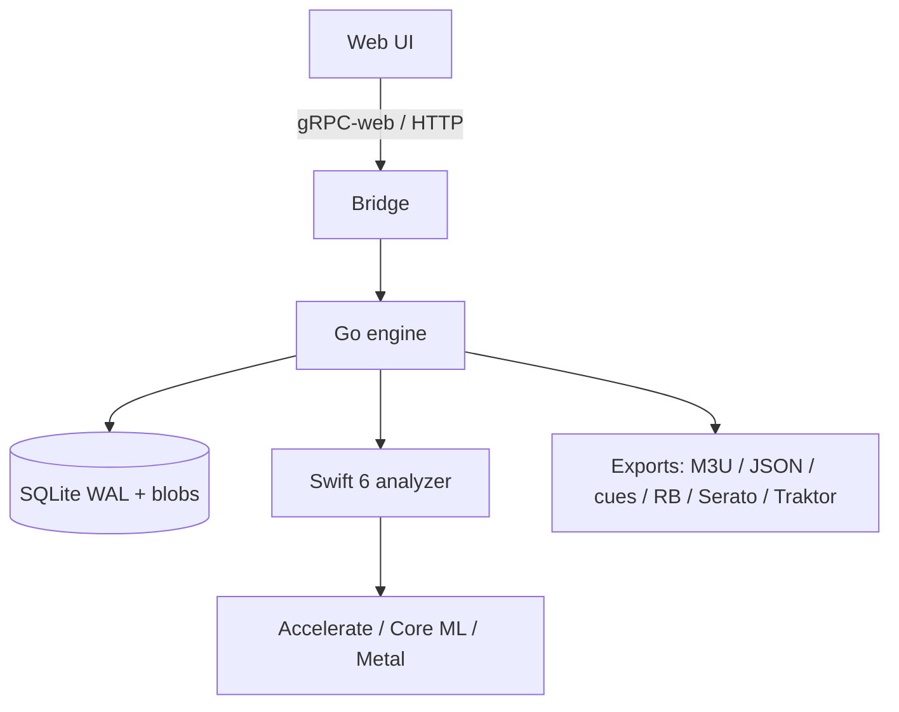

# Delivery Plan (as of 2026-01-29)

## Milestones
- M0 – Repo & UX/arch alignment (now → 2026-02-05): README, license, high-level diagrams, decide UI framework (Vite+React 19), lock protobuf/gRPC contracts draft.
- M1 – Engine ingest/analysis (2026-02-06 → 2026-02-26): file scanner, decode pipeline, beatgrid/key/energy/sections, analysis cache, SQLite schema, basic gRPC API.
- M2 – UI flows (2026-02-27 → 2026-03-20): library grid, track detail with waveform overlays, set builder with explanations, transition rehearsal preview, theme toggle (light/dark/auto).
- M3 – Export + E2E (2026-03-21 → 2026-04-10): exporters (M3U/JSON/cues + Rekordbox/Serato/Traktor), Playwright-Go E2E suite, golden corpus + property tests, README GIFs.
- M4 – Polish & release (2026-04-11 → 2026-04-25): perf tuning (Core ML/Metal fast paths), resilience (crash/retry), docs, install bundles.

## Workstreams & owners (placeholder)
- Engine (Go): ingest, analysis orchestration, graph scoring, API.
- Apple accel (Swift 6): FFT/STFT via Accelerate, Core ML inference, optional Metal fast path.
- Web UI (TS/React/Web Audio): library, cues, set builder, rehearsal, theme system.
- Tooling/CI: lint/test workflows, fixture generation, Playwright-Go runners, README assets.
- Export: Rekordbox/Serato/Traktor mappings + generic M3U/JSON/CSV.

## Risks & mitigations
- Accurate dynamic beatgrids on tempo-drifting audio → commit golden dynamic fixtures; property tests for monotonic beats.
- Core ML/Metal integration complexity → isolate in `analyzer-swift` process with protobuf contracts; keep CPU fallback.
- Cross-DJ-format fidelity (cues/beatgrids) → start from documented DB/export formats; build round-trip tests against sample libraries.
- Browser audio drift during rehearsal → Web Audio with AudioWorklet; pre-render preview tiles; align playback to beat indices.

## Architecture (at-a-glance)

## Analysis pipeline (outline)
1) Ingest: scan folders/exports, hash files, enqueue analysis jobs.
2) Decode: stream to fixed SR PCM, cache tiles; compute loudness (EBU R128) + peak.
3) Beatgrid: tempo + downbeat; static vs dynamic map with confidence.
4) Sections: label intro/break/build/drop/outro; store transition windows aligned to bars.
5) Key/energy: key + Camelot, global + sectional energy curve.
6) Cue candidates: up to 8, beat-aligned; types per spec; prevent unsafe placements.
7) Set graph: compute edge scores (key/tempo/energy/window overlap/user constraints); produce ordering with explanations.
8) Export: write M3U, analysis JSON, cues CSV; plus RB/Serato/Traktor writers.

## Testing strategy
- Unit: Go tests for scoring/math/DB; Swift XCTest for DSP kernels.
- Property-based: Rapid/Gopter for invariants (beat monotonicity, cue bounds, round-trips).
- Integration: golden corpus comparisons for analysis outputs (tolerate epsilon drift).
- E2E: Playwright-Go flows (import→analyze→cues→set→rehearse→export) across Chromium/WebKit; theme toggle tests.
- Fixtures: generated audio set (click ladder, swing hats, tempo ramp, EDM phrase, harmonic chords, club noise) under `testdata/audio` with seeded generator.

## Open questions to resolve
- Confirm priority ordering if export formats conflict (current default: Rekordbox first, then Serato, then Traktor).
- Packaging scope: macOS-only vs cross-platform; notarization requirements.
- Privacy stance: any telemetry? default should be off.

## Immediate next steps
- Draft protobuf/gRPC API surface between UI ↔ engine ↔ analyzer.
- Stub Go module + Swift package, set toolchain versions (Go 1.22+, Swift 6).
- Add CI skeleton (lint/test placeholders) and basic makefile for local dev.
- Start fixture generator scaffolding in Go.
