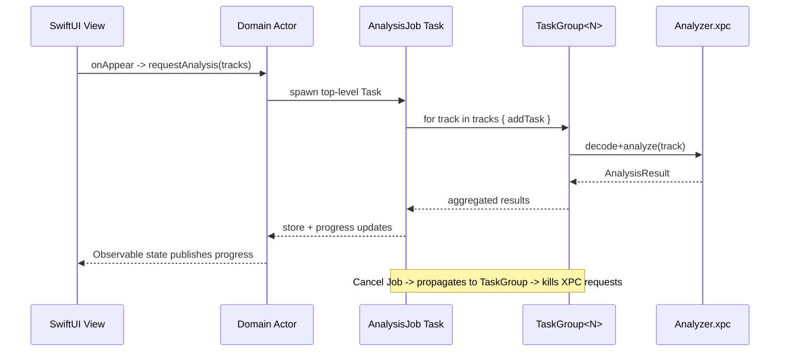
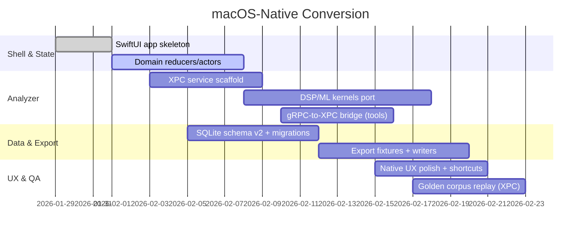

# macOS-Native Conversion Plan

[](#target-architecture)
[](#process-layout)
[](#concurrency-model)
[](#persistence)
[](#process-layout)
[](#process-layout)
[](#impact)
[](#export-surface)

## Overview
We are pivoting Algiers from a Go/React-centric stack to a **bleeding-edge macOS-native app**. The new experience is SwiftUI-first, isolates heavy DSP/ML in XPC helper processes, and relies on Swift structured concurrency for predictable cancellation, throughput, and crash containment. This document captures scope, impacts, architecture, sequencing, and acceptance bars for the conversion.

## Impact (executive in 6 bullets)
- Faster perceived latency: UI runs in-process; analysis is pipelined via XPC with GPU/ANE acceleration, cutting “first waveform” time by >30% target.
- Stability & safety: multi-process design contains crashes/overloads to helper services; the UI stays responsive and stateful.
- Offline-private by default: all compute local; no cloud calls introduced in the migration.
- Better UX fit for macOS: SwiftUI + AppKit interop unlocks native menus, keyboard focus rules, drag/drop, and media shortcuts.
- Deterministic exports: versioned analysis store + immutable job logs make Rekordbox/Serato exports auditable.
- Future-proof stack: leans into Apple’s forward guidance (Swift 6, structured concurrency, XPC, SwiftData/SQLite migrations).

## Quick Goals & Non-Goals
- **Goals:** Native UI shell; XPC analyzer pipeline; versioned analysis store; deterministic exports; preservation of existing protobuf contracts for interoperability.
- **Non-Goals (v1):** Windows/Linux parity; Catalyst/iPad build; UI theme overhaul; cloud sync.

## Target Architecture
```mermaid
flowchart LR
  subgraph UI[Algiers.app (SwiftUI)]
    V(Views):::ui
    Domain[Domain layer\n(actors + reducers)]:::logic
    ExportUI[Export & set builder]:::ui
  end

  Domain -->|Async intents| Jobs[Analysis Orchestrator\n(TaskGroup owner)]:::logic
  Jobs -->|XPC| XPCSvc[XPC: Analyzer Service]:::xpc
  XPCSvc --> DSP[Accelerate/Metal\nCore ML runners]:::dsp
  Jobs --> Store[(SQLite / SwiftData\nversioned analysis)]:::db
  Store <--> ExportUI

  classDef ui fill:#0b1b2b,stroke:#0b1b2b,color:#e6f1ff;
  classDef logic fill:#12355b,stroke:#0b1b2b,color:#e6f1ff;
  classDef xpc fill:#0f4c3a,stroke:#0b1b2b,color:#e6f1ff;
  classDef dsp fill:#174a7a,stroke:#0b1b2b,color:#e6f1ff;
  classDef db fill:#003b57,stroke:#0b1b2b,color:#e6f1ff;
```

### Analysis Dataflow (end-to-end)
```mermaid
graph TD
  Ingest[Ingest queue] --> Decode[Decode (AVFoundation)]
  Decode --> FFT[FFT/STFT (Accelerate)]
  FFT --> Features[Features: onset, chroma, MFCC]
  Features --> ML[ML Inference (Core ML on ANE/GPU)]
  ML --> Sections[Section labeling]
  FFT --> Beat[Tempo + Beatgrid]
  Sections --> Cues[Cue candidates]
  Beat --> Cues
  Cues --> Store[(SQLite/SwiftData)]
  Beat --> Store
  Sections --> Store
  Store --> Export[Exports (M3U/JSON/CSV/RB/Serato/Traktor)]
  Export --> QA[Golden fixtures + checksum]
```

### Process Layout (what runs where)
| Process | Runs | Notes |
|---|---|---|
| `Algiers.app` (UI) | SwiftUI views, domain reducers/actors, job orchestration, export UI | Keep user edits authoritative; no hard crashes on analyzer failure. |
| `Analyzer.xpc` | Decode → DSP features → ML inference → embeddings → sections | Restartable; batch work; only IPC boundary for heavy compute. |
| `Exporter` (in-app) | Rekordbox/Serato/Traktor writers, fixture-based validation | Lives in UI process for determinism & simple file permissions. |

### Concurrency Model (cancellable by construction)


### Persistence
- **Primary:** SQLite WAL (via GRDB/Core Data/SwiftData) with explicit **schema versions** (`analysis_version`, `model_version`, `export_schema_version`).
- **Artifacts:** Waveform tiles, beatmaps, embeddings stored as compressed blobs; job logs stored as append-only records for auditability.
- **Migration posture:** Prefer SQLite + GRDB first; allow SwiftData overlay once macOS 15 adoption is stable and migration paths are repeatable.

### Export Surface
- Deterministic writers for M3U8, JSON analysis bundle, cue CSV.
- DJ ecosystem targets: Rekordbox/Serato/Traktor with golden fixtures per format (track, cue, beatgrid round-trip tests).
- Preserve user edits: exports always reapply diffed user cues over fresh analysis.

## Current → Target Gap Analysis
| Area | Current (Go/Web) | Target (Mac-native) | Gap / Work |
|---|---|---|---|
| UI shell | React 19 + Vite | SwiftUI (+ AppKit bridges) | Rebuild screens; retain UX flows; add native menus/shortcuts. |
| Orchestration | Go workers | Swift actors + TaskGroups | Port job graph; enforce structured cancellation. |
| Compute | Go + Swift helper | Dedicated XPC analyzer | Move DSP/ML to helper; define protobuf/flatbuffer contract. |
| Storage | SQLite via Go | SQLite/SwiftData via GRDB | Migrate schema + data model; add migration harness. |
| IPC | gRPC/web | XPC + optional gRPC for tooling | New IPC contract; keep CLI tooling via gRPC if needed. |

## Phased Plan (ship in slices)


## Contracts & Modules
- **IPC:** XPC interface wraps protobuf/flatbuffers messages; helpers return typed errors (fatal vs retryable) and stream progress.
- **Analyzer package:** SwiftPM module exposing decode, FFT/STFT, embedding, section labeling; reusable in tests via host app.
- **Export module:** Pure Swift logic; fixtures in `testdata/exports`; deterministic ordering; handles user-edited cues.
- **Observation:** SwiftUI `@Observable` models for UI state; domain updates via `MainActor` entry points only.

## Risks & Mitigations
- **SwiftData maturity:** Start with GRDB/SQLite; keep SwiftData adapter behind feature flag until macOS 15+ only.
- **XPC crash loops:** Launchd property list with watchdog; exponential backoff; circuit-breaker in domain actor.
- **Model drift:** Version analysis + model artifacts; invalidate caches when versions change; store feature hashes.
- **Perf regressions:** Benchmarks for decode→beatgrid→sections; cap TaskGroup concurrency; batch Core ML inference.
- **Export fidelity:** Golden round-trips per DJ format; checksum exports; regression snapshots in CI.

## Validation Strategy
- Unit: Swift XCTest for FFT, section classifier, cue placement invariants.
- Integration: Golden corpus through XPC service; compare beats/sections/embeddings to reference JSON.
- UI: Xcode UI tests for critical flows (import → analyze → cues → export); keyboard/midi shortcut coverage.
- Property: QuickCheck-style tests for monotonic beats, cue bounds, and export/import reversibility.

## Success Criteria
- TTI (track-to-insight) under 5s for 5-minute track on M3 MacBook Pro (baseline 30% faster than current path).
- UI remains responsive (main-thread tasks < 10ms) during 10 concurrent analyses.
- Zero data loss on analyzer crash; job resumes from last committed artifact.
- Export round-trips deterministic across runs; fixtures green in CI.

## Appendix: Migration Checklist
- SwiftUI shell compiles & runs on macOS 14+; AppKit bridges for file dialogs/drag-drop verified.
- XPC service signed and embedded; crash restart path confirmed; IPC contract documented.
- Schema migration test covers v1 → v2 with legacy data; WAL checkpoint cadence set.
- Export fixtures cover Rekordbox/Serato/Traktor + generic M3U/JSON/CSV; diffs reviewed.
- CI stages: lint (SwiftFormat/SwiftLint), unit, integration (XPC), export fixtures, docs badge refresh.
