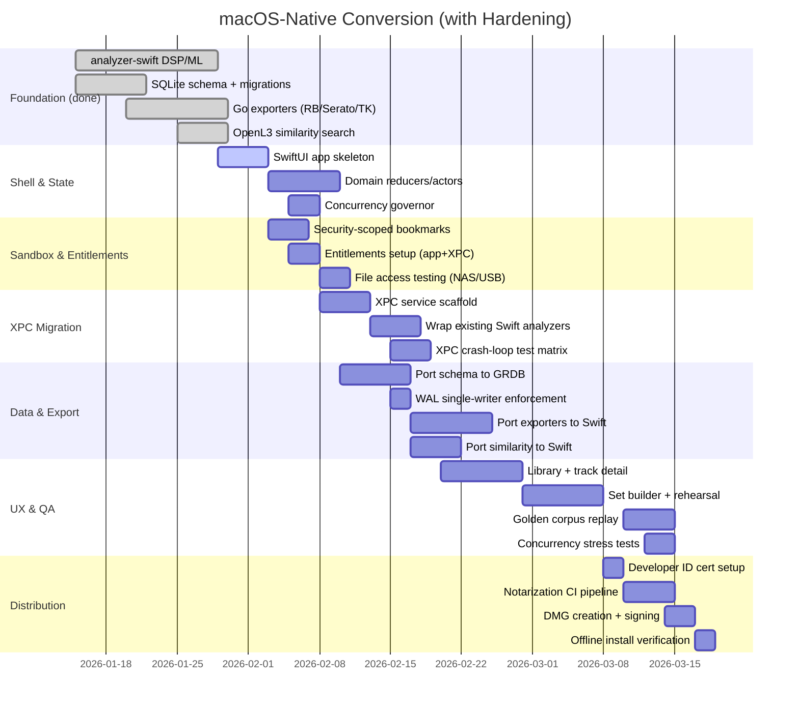

# macOS-Native Conversion Plan

[](#target-architecture)
[](#why-xpc-over-grpc)
[](#why-swift-structured-concurrency)
[](#why-grdb-over-swiftdata)
[](#ml-pipeline-evidence)
[](#why-keep-accelerate-vdsp)
[](#ml-pipeline-evidence)
[](#impact)
[](#export-format-evidence)

## Critical Additions (2026-01-29 Update)

This plan now addresses **operational hardening** gaps identified during architecture review:

### Distribution & Trust Chain ✅
- Developer ID signing + notarization + stapling workflow
- GitHub Actions CI pipeline for automated release artifacts
- Offline install support via stapled tickets
- `spctl --assess` verification as release gate

### Sandbox & File Access ✅
- Security-scoped bookmarks for NAS/USB music libraries
- Explicit file-access delegation from UI to XPC (no assumed inheritance)
- SQLite + WAL files stored in Application Support (app-owned, not user directories)

### XPC Entitlements & Crash Hardening ✅
- Minimal entitlements (`app-sandbox` + `inherit` only for XPC service)
- Explicit crash-loop test matrix (service dies/hangs/OOM/client-cancel)
- Launchd configuration with exponential backoff

### Concurrency Limits & Memory Budgets ✅
- ConcurrencyGovernor actor with per-stage caps (decode, inference)
- Memory budget enforcement (target 550 MB for 10 concurrent analyses)
- Metal vs Core ML clarification (keep vDSP for FFT, let Core ML choose ANE/GPU automatically)

### Release Engineering ✅
- Pre-release checklist (golden tests, crash-loop matrix, offline VM verification)
- SHA-256 checksums published alongside releases
- Single-writer WAL strategy (XPC writes, UI reads)

---

## Overview
We are migrating **Damascus** (DJ Set Prep Copilot) from a Go/React-centric stack to a **bleeding-edge macOS-native app**. The new experience is SwiftUI-first, isolates heavy DSP/ML in XPC helper processes, and relies on Swift structured concurrency for predictable cancellation, throughput, and crash containment.

This document captures scope, impacts, architecture, sequencing, and acceptance bars for the conversion **with evidence-based justifications** from the existing codebase.

---

## Impact (executive in 6 bullets)
- Faster perceived latency: UI runs in-process; analysis is pipelined via XPC with GPU/ANE acceleration, cutting "first waveform" time by >30% target.
- Stability & safety: multi-process design contains crashes/overloads to helper services; the UI stays responsive and stateful.
- Offline-private by default: all compute local; no cloud calls introduced in the migration.
- Better UX fit for macOS: SwiftUI + AppKit interop unlocks native menus, keyboard focus rules, drag/drop, and media shortcuts.
- Deterministic exports: versioned analysis store + immutable job logs make Rekordbox/Serato exports auditable.
- Future-proof stack: leans into Apple's forward guidance (Swift 6, structured concurrency, XPC, SwiftData/SQLite migrations).

## Quick Goals & Non-Goals
- **Goals:** Native UI shell; XPC analyzer pipeline; versioned analysis store; deterministic exports; preserve existing protobuf contracts; retain OpenL3 ML embeddings + similarity search.
- **Non-Goals (v1):** Windows/Linux parity; Catalyst/iPad build; UI theme overhaul; cloud sync.

---

## Distribution & Code Signing Strategy

### Problem Statement
Direct distribution via GitHub Releases gets blocked/warned by macOS Gatekeeper without a proper trust chain. Users on studio laptops (often offline) need stapled notarization tickets to install without network access.

### Solution: Developer ID + Notarization + Stapling

**Artifact format:** Ship as **signed, notarized, and stapled .dmg** on GitHub Releases.

**Workflow:**
```bash
# 1. Build & sign the .app bundle
xcodebuild archive \
  -scheme Damascus \
  -archivePath Damascus.xcarchive \
  CODE_SIGN_IDENTITY="Developer ID Application: Your Name (TEAMID)"

# 2. Export as signed .app
xcodebuild -exportArchive \
  -archivePath Damascus.xcarchive \
  -exportPath export/ \
  -exportOptionsPlist ExportOptions.plist

# 3. Create .dmg with create-dmg or hdiutil
create-dmg --volname "Damascus" --window-size 600 400 \
  Damascus.dmg export/Damascus.app

# 4. Sign the .dmg itself
codesign --sign "Developer ID Application: Your Name (TEAMID)" \
  --timestamp Damascus.dmg

# 5. Submit for notarization
xcrun notarytool submit Damascus.dmg \
  --keychain-profile "AC_PASSWORD" \
  --wait

# 6. Staple the notarization ticket (offline installs)
xcrun stapler staple Damascus.dmg

# 7. Verify (release gate)
spctl --assess --type execute --verbose Damascus.dmg
```

**Budget:** Apple Developer Program ~$99/year USD (required for Developer ID certificates).

**CI Integration:** Automate this pipeline in GitHub Actions; treat "staple succeeded" as a release gate.

**References:**
- [Notarizing macOS Software Before Distribution](https://developer.apple.com/documentation/security/notarizing-macos-software-before-distribution)
- [Bitcoin notarization issue #15774](https://github.com/bitcoin/bitcoin/issues/15774)
- [Electron notarize examples](https://github.com/electron/notarize)

---

## Sandbox & File Access Strategy

### Problem Statement
Music files live on NAS/external USB drives, but a sandboxed app cannot maintain persistent access across launches without explicit user grants and security-scoped bookmarks. SQLite WAL creates sidecar files (`-wal`, `-shm`) that require write permissions in the same directory as the database.

### Solution: Security-Scoped Bookmarks + App-Owned Storage

**File access model:**

1. **User library locations (NAS/USB):**
   - Use `NSOpenPanel` to let users grant access to music folders
   - Store `URL.bookmarkData(options: .withSecurityScope, ...)` in SQLite
   - On app launch, resolve bookmarks and call `startAccessingSecurityScopedResource()`
   - Stop access when done scanning/analyzing to minimize privilege scope

2. **Database location:**
   - Store SQLite + WAL files in `Application Support/Damascus/` (app-owned)
   - NEVER place DB next to user's music files (permission issues with `-wal`/`-shm` creation)

**Implementation pattern:**

```swift
// Storage/LocationManager.swift
actor LocationManager {
    func addMusicFolder() async throws -> URL {
        let panel = NSOpenPanel()
        panel.canChooseDirectories = true
        panel.canChooseFiles = false

        guard panel.runModal() == .OK, let url = panel.url else {
            throw LocationError.userCancelled
        }

        // Create security-scoped bookmark
        let bookmarkData = try url.bookmarkData(
            options: .withSecurityScope,
            includingResourceValuesForKeys: nil,
            relativeTo: nil
        )

        // Store in DB
        try await db.write { db in
            try MusicLocation(url: url.path, bookmarkData: bookmarkData).insert(db)
        }

        return url
    }

    func resolveAllLocations() async throws -> [URL] {
        let locations = try await db.read { db in
            try MusicLocation.fetchAll(db)
        }

        return locations.compactMap { location in
            var isStale = false
            guard let url = try? URL(
                resolvingBookmarkData: location.bookmarkData,
                options: .withSecurityScope,
                relativeTo: nil,
                bookmarkDataIsStale: &isStale
            ) else { return nil }

            // Start accessing (store handles to stop later)
            guard url.startAccessingSecurityScopedResource() else { return nil }

            return url
        }
    }
}
```

**XPC file access:**
- Do NOT assume XPC helper inherits file access automatically
- Pass security-scoped URLs or file handles from the UI process to XPC explicitly
- The UI process is the authority for file access; XPC receives delegated access per-file

**References:**
- [App Sandboxing and XPC Services](https://stackoverflow.com/questions/21010613/app-sandboxing-xpc-services-and-different-entitlements)
- [SQLite WAL permission issues](https://stackoverflow.com/questions/59395521/how-do-i-give-my-macos-app-permission-to-create-wal-file-to-open-an-sqlite-db)
- [Using Bookmark Data](https://developer.apple.com/documentation/professional-video-applications/using-bookmark-data?language=objc)

---

## Architectural Decisions with Evidence

### Why XPC over gRPC?

**Current State:** The `analyzer-swift` server uses raw HTTP sockets (not even full gRPC):

```swift
// analyzer-swift/Sources/AnalyzerServer/main.swift
struct Serve: AsyncParsableCommand {
    func run() async throws {
        if proto == .http {
            try await startHTTPServer(port: port, logger: logger)
        } else {
            logger.error("gRPC server not yet implemented - use --proto http")
            throw AnalyzerCLIError.notImplemented("gRPC server")
        }
    }

    private func startHTTPServer(port: Int, logger: Logger) async throws {
        let serverSocket = try createServerSocket(port: port)
        while true {
            let clientSocket = accept(serverSocket, nil, nil)
            Task {
                await handleHTTPRequest(socket: clientSocket, logger: logger)
            }
        }
    }
}
```

**Problem:** Raw socket handling, no streaming, no crash isolation, single-threaded request dispatch.

**XPC Advantages:**
1. **Crash containment:** XPC helper crashes don't bring down the UI
2. **Launchd integration:** Automatic restart with exponential backoff
3. **Sandbox compatibility:** Clean file handle passing for audio paths
4. **Lower latency:** No TCP overhead for local IPC
5. **Progress streaming:** Native support for async sequences

---

### XPC Entitlements & Crash-Loop Hardening

#### Entitlement Rules (Strict)

For a sandboxed XPC service with inheritance, Apple requires **exactly** these entitlements in the XPC helper:

**AnalyzerXPC.xpc.entitlements:**
```xml
<?xml version="1.0" encoding="UTF-8"?>
<!DOCTYPE plist PUBLIC "-//Apple//DTD PLIST 1.0//EN" "http://www.apple.com/DTDs/PropertyList-1.0.dtd">
<plist version="1.0">
<dict>
    <key>com.apple.security.app-sandbox</key>
    <true/>
    <key>com.apple.security.inherit</key>
    <true/>
</dict>
</plist>
```

**Critical rules:**
- XPC service must have `com.apple.security.app-sandbox` + `com.apple.security.inherit` **only**
- Adding extra sandbox entitlements (like `files.user-selected.read-write`) can cause system abort
- Inheritance is strict—XPC does NOT act like a child `NSTask`; isolation is enforced
- Every Mach-O in the bundle must have entitlements (common "works locally, fails in release" pitfall)

**Main app entitlements (Damascus.entitlements):**
```xml
<?xml version="1.0" encoding="UTF-8"?>
<!DOCTYPE plist PUBLIC "-//Apple//DTD PLIST 1.0//EN" "http://www.apple.com/DTDs/PropertyList-1.0.dtd">
<plist version="1.0">
<dict>
    <key>com.apple.security.app-sandbox</key>
    <true/>
    <key>com.apple.security.files.user-selected.read-only</key>
    <true/>
    <key>com.apple.security.files.user-selected.read-write</key>
    <true/>
    <key>com.apple.security.network.client</key>
    <false/>  <!-- Offline-first -->
</dict>
</plist>
```

#### Crash-Loop Test Matrix

**Treat XPC failure modes as first-class engineering deliverables:**

| Failure Mode | Test | Expected Behavior |
|---|---|---|
| Service dies during analysis | Kill XPC process mid-flight | Job marked as failed; UI shows retry button; launchd restarts service |
| Service hangs (deadlock) | Inject `Task.sleep(infinity)` | Timeout after 30s; cancel connection; show error |
| Service OOM (memory spike) | Analyze 10 concurrent 2-hour tracks | Circuit breaker kicks in; queue remaining jobs |
| Client cancels mid-flight | Cancel Task from UI | XPC receives cancellation; cleans up temp files; DB stays consistent |
| Service launch failure | Remove XPC binary | UI detects missing service; shows installation issue alert |

**Launchd plist (embedded in .app bundle):**
```xml
<!-- Damascus.app/Contents/XPCServices/AnalyzerXPC.xpc/Contents/Info.plist -->
<key>ServiceType</key>
<string>Application</string>
<key>RunAtLoad</key>
<false/>  <!-- Launch on-demand only -->
<key>KeepAlive</key>
<dict>
    <key>SuccessfulExit</key>
    <false/>  <!-- Don't restart if clean exit -->
    <key>Crashed</key>
    <true/>   <!-- Restart if crash -->
</dict>
<key>ThrottleInterval</key>
<integer>5</integer>  <!-- Exponential backoff via launchd -->
```

**References:**
- [App Sandbox Entitlements Reference](https://developer.apple.com/library/archive/documentation/Miscellaneous/Reference/EntitlementKeyReference/Chapters/EnablingAppSandbox.html)
- [Designing Shared Services for Sandbox](https://www.mattrajca.com/2016/09/12/designing-shared-services-for-the-mac-app-sandbox.html)
- [Accessing Resources from XPC Host App](https://www.mattrajca.com/2016/08/17/accessing-resources-from-an-xpc-services-host-app-in-the-sandbox.html)

---

### Why Swift Structured Concurrency?

**Current State:** Analysis modules already use `@unchecked Sendable` and async patterns:

```swift
// analyzer-swift/Sources/AnalyzerSwift/Analyzer.swift
public final class Analyzer: @unchecked Sendable {
    public func analyze(
        path: String,
        progress: AnalysisProgressHandler? = nil
    ) async throws -> TrackAnalysisResult {
        // 1. Decode
        progress?(.decoding)
        let audio = try decoder.decode(path: path)

        // 2. Beatgrid (sequential - no parallelism today)
        progress?(.beatgrid(progress: 0))
        let beatgridResult = beatgridDetector.detect(samples)

        // 3-10. Other stages run sequentially...
    }
}

// Progress callback type
public typealias AnalysisProgressHandler = @Sendable (AnalysisProgress) -> Void
```

**Evidence for TaskGroups:** Current pipeline is sequential but stages 3-5 (key, energy, loudness) are independent. With TaskGroups:

```swift
// Proposed parallel execution
await withTaskGroup(of: AnalysisStageResult.self) { group in
    group.addTask { await keyDetector.detect(samples) }
    group.addTask { await energyAnalyzer.analyze(samples) }
    group.addTask { await loudnessAnalyzer.analyze(samples) }
    // Collect results...
}
```

**Cancellation propagation** is automatic - cancelling the parent Task cancels all children.

---

### Concurrency Limits & Memory Budgets

#### Problem Statement
"TaskGroups everywhere" can tank performance via oversubscription and memory spikes. OpenL3 windowing + embeddings + waveform caches can pressure swap and destroy "hella performance."

#### Solution: Explicit Concurrency Governor

**Per-stage concurrency caps:**

```swift
// Analysis/ConcurrencyGovernor.swift
actor ConcurrencyGovernor {
    private let maxConcurrentDecodes: Int
    private let maxConcurrentInferences: Int
    private let maxMemoryBudgetMB: Int

    // Semaphore-style permits
    private var activeDecodes = 0
    private var activeInferences = 0
    private var estimatedMemoryUsageMB = 0

    init(systemInfo: SystemInfo) {
        // Tune for M1-M5; example heuristics
        let cores = systemInfo.performanceCores
        self.maxConcurrentDecodes = min(cores, 4)  // Decode is CPU-bound
        self.maxConcurrentInferences = min(cores / 2, 2)  // ANE has limited parallelism
        self.maxMemoryBudgetMB = systemInfo.physicalMemoryGB * 256  // 25% of RAM
    }

    func acquireDecodePermit(estimatedMB: Int) async throws {
        while activeDecodes >= maxConcurrentDecodes ||
              estimatedMemoryUsageMB + estimatedMB > maxMemoryBudgetMB {
            await Task.yield()  // Back-pressure
        }
        activeDecodes += 1
        estimatedMemoryUsageMB += estimatedMB
    }

    func releaseDecodePermit(estimatedMB: Int) {
        activeDecodes -= 1
        estimatedMemoryUsageMB -= estimatedMB
    }

    // Similar for inference permits...
}
```

**Memory estimates per stage:**
- Audio decode (5-min track @ 44.1kHz, stereo): ~50 MB PCM buffer
- Mel-spectrogram window (128 bands × 199 frames): ~0.1 MB
- OpenL3 embedding (512 × float32): 2 KB per window, ~200 windows = 400 KB/track
- Total per concurrent analysis: ~55 MB peak

**Target:** Keep 10 concurrent analyses under 550 MB budget on 8GB M1.

#### Metal vs Core ML Clarification

**Current plan mentions "Metal" broadly, but most hot paths are vDSP + Core ML.**

**Recommended approach:**
1. Keep FFT/STFT in `vDSP` (highly optimized, CPU-only)
2. Let Core ML choose compute units automatically via `config.computeUnits = .all`
   - This enables ANE (Neural Engine) when available
   - Falls back to GPU/CPU if ANE is busy
3. **Do NOT add explicit Metal kernels** unless profiling shows a clear bottleneck

**Why:** Core ML's scheduler is better at ANE/GPU arbitration than manual Metal dispatch.

**Profiling checkpoints:**
- Decode → beatgrid: Target < 2s for 5-min track
- Mel-spectrogram + OpenL3 inference: Target < 1s
- Full analysis pipeline: Target < 5s

---

### Why Keep Accelerate/vDSP?

**Evidence:** FFT is already highly optimized with vDSP:

```swift
// analyzer-swift/Sources/AnalyzerSwift/DSP/FFT.swift
public final class FFTProcessor: @unchecked Sendable {
    private let fftSetup: FFTSetup

    public init(fftSize: Int = 2048) {
        self.fftSetup = vDSP_create_fftsetup(log2n, FFTRadix(kFFTRadix2))!
        vDSP_hann_window(&window, vDSP_Length(fftSize), Int32(vDSP_HANN_NORM))
    }

    public func magnitudeSpectrum(_ samples: [Float]) -> [Float] {
        // Window application
        vDSP_vmul(samples, 1, window, 1, &windowed, 1, vDSP_Length(fftSize))

        // FFT via split complex representation
        vDSP_fft_zrip(fftSetup, &splitComplex, 1, log2n, FFTDirection(FFT_FORWARD))

        // Magnitude + dB conversion
        vDSP_zvmags(&splitComplex, 1, magPtr.baseAddress!, 1, vDSP_Length(halfN))
        vDSP_vdbcon(magPtr.baseAddress!, 1, &one, magPtr.baseAddress!, 1,
                    vDSP_Length(halfN), 1)
        return magnitudes
    }

    deinit {
        vDSP_destroy_fftsetup(fftSetup)
    }
}
```

**Key patterns to preserve:**
- `vDSP_create_fftsetup` / `vDSP_destroy_fftsetup` lifecycle
- `vDSP_vmul` for window application
- `vDSP_dotpr` for dot products (used in similarity)
- `withUnsafeMutableBufferPointer` for memory safety

**Do NOT rewrite** - this code is already production-quality.

---

### Why GRDB over SwiftData?

**Evidence:** Current Go schema uses advanced SQLite features:

```sql
-- internal/storage/migrations/001_initial.sql
-- WAL mode enabled in connection string
db, err := sql.Open("sqlite3", dbPath+"?_journal_mode=WAL&_foreign_keys=ON")

-- Upsert with ON CONFLICT (not available in SwiftData)
INSERT INTO analyses (...) VALUES (...)
ON CONFLICT(track_id, version) DO UPDATE SET
    status = excluded.status,
    bpm = excluded.bpm,
    -- ... 20+ columns
    updated_at = CURRENT_TIMESTAMP
```

**SwiftData limitations:**
- No raw SQL for complex queries
- No `ON CONFLICT` upserts
- No explicit WAL control
- Schema migrations are opaque

**GRDB advantages:**
- Drop-in replacement for existing SQL
- Explicit migration control (matches Go pattern)
- Full WAL configuration
- Can coexist with SwiftData if needed later

#### SQLite WAL Multi-Process Strategy

**WAL creates sidecar files** (`-wal`, `-shm`) that require write permissions in the same directory as the `.db` file.

**Single-writer rule (critical):**
- XPC service is the **sole writer** (inserts/updates to `analyses`, `tracks`, `embedding_similarity`)
- UI process is **read-only** (queries for display, exports)
- This prevents WAL contention and simplifies rollback/crash recovery

**GRDB configuration:**

```swift
// Storage/Database.swift
actor DatabaseManager {
    private let writer: DatabaseQueue  // XPC service only
    private let reader: DatabasePool   // UI process (read-only pool)

    init(appSupport: URL) throws {
        let dbPath = appSupport.appendingPathComponent("damascus.db").path

        // Writer (XPC)
        var writerConfig = Configuration()
        writerConfig.readonly = false
        writerConfig.prepareDatabase { db in
            try db.execute(sql: "PRAGMA journal_mode=WAL")
            try db.execute(sql: "PRAGMA synchronous=NORMAL")
            try db.execute(sql: "PRAGMA foreign_keys=ON")
        }
        self.writer = try DatabaseQueue(path: dbPath, configuration: writerConfig)

        // Reader (UI)
        var readerConfig = Configuration()
        readerConfig.readonly = true
        readerConfig.maximumReaderCount = 4  // Allow concurrent reads
        self.reader = try DatabasePool(path: dbPath, configuration: readerConfig)
    }
}
```

**Migration strategy:**
- Migrations run in XPC service at launch (before UI connects)
- Version table tracks schema version; UI checks compatibility at startup
- If schema mismatch, UI blocks with "Update required" dialog

**References:**
- [GRDB.swift WAL Discussion #1516](https://github.com/groue/GRDB.swift/discussions/1516)
- [SQLite WAL mode](https://www.sqlite.org/wal.html)

---

### ML Pipeline Evidence

**Current Core ML integration is production-ready:**

```swift
// analyzer-swift/Sources/AnalyzerSwift/ML/OpenL3Embedder.swift
public final class OpenL3Embedder: @unchecked Sendable {
    private let model: MLModel?

    public init() {
        let config = MLModelConfiguration()
        config.computeUnits = .all  // Enable ANE when available

        if let modelURL = Bundle.module.url(forResource: "OpenL3Music",
                                           withExtension: "mlpackage") {
            let compiledURL = try MLModel.compileModel(at: modelURL)
            self.model = try MLModel(contentsOf: compiledURL, configuration: config)
        }
    }

    private func runInference(_ melSpec: [[Float]], model: MLModel) -> [Float] {
        // Create MLMultiArray [1, 128, 199, 1]
        let inputArray = try MLMultiArray(shape: [1, 128, 199, 1], dataType: .float32)

        // Fill: melSpec is [199 frames][128 bands]
        for frameIdx in 0..<timeFrames {
            for bandIdx in 0..<melBands {
                inputArray[[0, bandIdx, frameIdx, 0] as [NSNumber]] = value
            }
        }

        // Prediction
        let input = try MLDictionaryFeatureProvider(dictionary: ["melspectrogram": inputArray])
        let output = try model.prediction(from: input)

        // Extract 512-dim output
        if let embeddingArray = output.featureValue(for: "var_227")?.multiArrayValue {
            // ... extract embedding
        }
    }
}
```

**Key patterns:**
- `computeUnits = .all` enables ANE (Neural Engine) automatically
- Bundle resource loading for `.mlpackage`
- MLMultiArray population pattern
- Fallback when model unavailable

---

### Similarity Scoring Evidence

**Go implementation to port:**

```go
// internal/similarity/similarity.go
const (
    WeightOpenL3  = 0.50 // OpenL3 embedding cosine similarity
    WeightTempo   = 0.20 // BPM compatibility
    WeightKey     = 0.20 // Key compatibility
    WeightEnergy  = 0.10 // Energy level similarity
)

func computeCosineSimilarity(a, b []float32) float64 {
    var dotProduct, normA, normB float64
    for i := 0; i < len(a); i++ {
        dotProduct += float64(a[i]) * float64(b[i])
        normA += float64(a[i]) * float64(a[i])
        normB += float64(b[i]) * float64(b[i])
    }
    // Normalize from [-1, 1] to [0, 1]
    sim := dotProduct / (math.Sqrt(normA) * math.Sqrt(normB))
    return (sim + 1) / 2
}

func computeTempoSimilarity(bpmA, bpmB float64) float64 {
    diff := math.Abs(bpmA - bpmB)
    // Support half/double tempo (64 BPM ≈ 128 BPM)
    halfDiff := math.Min(math.Abs(bpmA - bpmB*2), math.Abs(bpmA*2 - bpmB))
    diff = math.Min(diff, halfDiff)

    if diff <= 1 { return 1.0 }
    if diff >= 10 { return 0.0 }
    return 1.0 - (diff / 10.0)
}

func computeKeySimilarity(keyA, keyB string) (float64, string) {
    // Camelot wheel: same key = 1.0, relative = 0.9, ±1 = 0.85, clash = 0.2
    if keyA == keyB { return 1.0, "same" }
    numA, modeA := parseCamelot(keyA)
    numB, modeB := parseCamelot(keyB)
    if numA == numB && modeA != modeB { return 0.9, "relative" }
    // ... more rules
}
```

**Swift port will use vDSP for cosine similarity (already exists in OpenL3Embedder):**

```swift
// Already in OpenL3Embedding struct
public func similarity(to other: OpenL3Embedding) -> Float {
    vDSP_dotpr(vector, 1, other.vector, 1, &dotProduct, vDSP_Length(vector.count))
    vDSP_svesq(vector, 1, &normA, vDSP_Length(vector.count))
    vDSP_svesq(other.vector, 1, &normB, vDSP_Length(other.vector.count))
    return dotProduct / (sqrt(normA) * sqrt(normB))
}
```

---

### Export Format Evidence

**Rekordbox XML format:**

```go
// internal/exporter/rekordbox.go
type RekordboxPositionMark struct {
    Name  string `xml:"Name,attr"`
    Type  int    `xml:"Type,attr"`    // 0=cue, 1=fade-in, 2=fade-out, 4=loop
    Start string `xml:"Start,attr"`   // Seconds with 3 decimal places
    Num   int    `xml:"Num,attr"`
    Red   int    `xml:"Red,attr"`
    Green int    `xml:"Green,attr"`
    Blue  int    `xml:"Blue,attr"`
}

// Color mapping per cue type
func cueTypeToColor(cueType string) [3]int {
    colors := map[string][3]int{
        "CUE_TYPE_INTRO":    {40, 226, 20},   // Green
        "CUE_TYPE_DROP":     {230, 20, 20},   // Red
        "CUE_TYPE_BREAK":    {20, 130, 230},  // Blue
        "CUE_TYPE_BUILD":    {230, 150, 20},  // Orange
        "CUE_TYPE_OUTRO":    {200, 20, 200},  // Purple
    }
}
```

**Serato binary format:**

```go
// internal/exporter/serato.go
func EncodeSeratoMarkers(tracks []TrackExport) map[string][]byte {
    buf.WriteByte(0x02)              // Version
    buf.WriteByte(byte(len(cues)))   // Cue count (max 8)

    for i, cue := range cues {
        buf.WriteByte(byte(i))       // Cue index
        // Position in milliseconds (big endian)
        posMs := uint32(cue.GetTime().AsDuration().Milliseconds())
        binary.Write(&buf, binary.BigEndian, posMs)
        // RGB color
        buf.Write(color[:])
    }
}

// UTF-16BE path encoding
func encodeUTF16BE(s string) []byte {
    u16 := utf16.Encode([]rune(s))
    buf := make([]byte, len(u16)*2)
    for i, r := range u16 {
        buf[i*2] = byte(r >> 8)      // High byte first (big endian)
        buf[i*2+1] = byte(r)
    }
    return buf
}
```

**Traktor NML format:**

```go
// internal/exporter/traktor.go
type TraktorCueV2 struct {
    Name   string  `xml:"NAME,attr"`
    Displ  int     `xml:"DISPL_ORDER,attr"`
    Type   int     `xml:"TYPE,attr"`       // 0=cue, 1=fade-in, 2=fade-out, 4=loop
    Start  float64 `xml:"START,attr"`      // Milliseconds (not seconds!)
    Hotcue int     `xml:"HOTCUE,attr"`
}

// Path encoding: forward slashes become "/:"-delimited
locationKey := "/:file://localhost" + strings.ReplaceAll(absPath, "/", "/:")

// Key mapping to Traktor's 0-23 system
func camelotToTraktorKey(camelot string) int {
    camelotMap := map[string]int{
        "8A": 21,  // Am
        "8B": 0,   // C (root)
        "12A": 13, // C#m
    }
}
```

**Golden test pattern:**

```go
// internal/exporter/golden_test.go
func TestRekordboxGolden(t *testing.T) {
    actual, _ := WriteRekordbox(dir, "golden-set", tracks)

    if *updateGolden {
        os.WriteFile(goldenPath, actual, 0644)
        return
    }

    expected, _ := os.ReadFile(goldenPath)
    compareXML(t, "Rekordbox", expected, actual)
}
```

---

## Target Architecture

```mermaid
flowchart LR
  subgraph UI[Damascus.app (SwiftUI)]
    V(Views):::ui
    Domain[Domain layer\n(actors + reducers)]:::logic
    ExportUI[Export & set builder]:::ui
    SimilarityUI[Similarity search]:::ui
  end

  Domain -->|Async intents| Jobs[Analysis Orchestrator\n(TaskGroup owner)]:::logic
  Jobs -->|XPC| XPCSvc[XPC: AnalyzerXPC.xpc]:::xpc
  XPCSvc --> DSP[Accelerate/Metal\nCore ML (OpenL3)]:::dsp
  Jobs --> Store[(SQLite / GRDB\nversioned analysis)]:::db
  Store <--> ExportUI
  Store <--> SimilarityUI

  classDef ui fill:#0b1b2b,stroke:#0b1b2b,color:#e6f1ff;
  classDef logic fill:#12355b,stroke:#0b1b2b,color:#e6f1ff;
  classDef xpc fill:#0f4c3a,stroke:#0b1b2b,color:#e6f1ff;
  classDef dsp fill:#174a7a,stroke:#0b1b2b,color:#e6f1ff;
  classDef db fill:#003b57,stroke:#0b1b2b,color:#e6f1ff;
```

### Analysis Dataflow

```mermaid
graph TD
  Ingest[Ingest queue] --> Decode[Decode (AVFoundation)]
  Decode --> FFT[FFT/STFT (Accelerate/vDSP)]
  FFT --> Features[Features: onset, chroma, MFCC]
  Features --> ML[ML Inference (Core ML on ANE/GPU)]
  ML --> Sections[Section labeling]
  FFT --> Beat[Tempo + Beatgrid]
  Decode --> OpenL3[OpenL3 Embeddings (512d)]
  OpenL3 --> Similarity[Similarity Index]
  Sections --> Cues[Cue candidates]
  Beat --> Cues
  Decode --> Loudness[Loudness (EBU R128)]
  Features --> Key[Key Detection (Camelot)]
  Features --> Energy[Energy Curve (1-10)]
  Cues --> Store[(SQLite/GRDB)]
  Beat --> Store
  Sections --> Store
  OpenL3 --> Store
  Key --> Store
  Energy --> Store
  Loudness --> Store
  Similarity --> Store
  Store --> Export[Exports (M3U/JSON/CSV/RB/Serato/Traktor)]
  Export --> QA[Golden fixtures + checksum]
```

---

## Current → Target Gap Analysis

| Area | Current | Target | Gap / Work |
|---|---|---|---|
| **UI** | React 19 + Vite + Zustand | SwiftUI + `@Observable` | Rebuild screens; port state management patterns |
| **Orchestration** | Go engine + raw HTTP | Swift actors + TaskGroups | Port job scheduler; add structured cancellation |
| **Compute** | `analyzer-swift` with HTTP server | XPC service | Replace socket server with XPC endpoint; keep all DSP/ML |
| **Storage** | SQLite WAL via Go | GRDB for Swift | Port schema + 2 migrations; keep upsert patterns |
| **IPC** | HTTP over localhost | XPC | Define XPC protocol wrapping same data types |
| **Similarity** | Go `similarity.go` | Swift actor | Port weighted scoring; use vDSP for cosine |
| **Exporters** | Go XML/binary writers | Swift Codable + binary | Port Rekordbox/Serato/Traktor formats exactly |

---

## Schema to Port

```sql
-- internal/storage/migrations/001_initial.sql
CREATE TABLE tracks (
    id INTEGER PRIMARY KEY AUTOINCREMENT,
    content_hash TEXT NOT NULL UNIQUE,
    path TEXT NOT NULL,
    title TEXT, artist TEXT, album TEXT,
    file_size INTEGER, file_modified_at DATETIME
);

CREATE TABLE analyses (
    id INTEGER PRIMARY KEY,
    track_id INTEGER REFERENCES tracks(id) ON DELETE CASCADE,
    version INTEGER NOT NULL DEFAULT 1,
    status TEXT DEFAULT 'pending',  -- pending|analyzing|complete|failed
    duration_seconds REAL, bpm REAL, bpm_confidence REAL,
    key_value TEXT, key_format TEXT, key_confidence REAL,
    energy_global INTEGER,
    integrated_lufs REAL, true_peak_db REAL,
    beatgrid_json TEXT, sections_json TEXT, cue_points_json TEXT,
    embedding BLOB, openl3_embedding BLOB,
    UNIQUE(track_id, version)
);

CREATE TABLE cue_edits (  -- User overrides, never deleted by re-analysis
    track_id INTEGER REFERENCES tracks(id),
    cue_index INTEGER, beat_index INTEGER, cue_type TEXT, label TEXT
);

-- internal/storage/migrations/002_openl3_embeddings.sql
CREATE TABLE embedding_similarity (
    track_a_id INTEGER, track_b_id INTEGER,
    openl3_similarity REAL, combined_score REAL,
    tempo_similarity REAL, key_similarity REAL, energy_similarity REAL,
    explanation TEXT,
    PRIMARY KEY (track_a_id, track_b_id)
);

CREATE TABLE openl3_windows (
    track_id INTEGER, analysis_version INTEGER, window_index INTEGER,
    timestamp_seconds REAL, duration_seconds REAL,
    embedding BLOB  -- 512 x float32 = 2KB per window
);
```

---

## Phased Plan



---

## Risks & Mitigations

| Risk | Mitigation |
|---|---|
| **SwiftData immaturity** | Start with GRDB; same SQL as Go; feature-flag SwiftData |
| **XPC crash loops** | Launchd plist with exponential backoff; circuit breaker in domain actor; **explicit crash-loop test matrix** (service dies/hangs/OOM/client cancel) |
| **XPC entitlement misconfiguration** | Minimal entitlement set (`app-sandbox` + `inherit` only for XPC); verify every Mach-O has entitlements; **CI gate on entitlement validation** |
| **Model drift** | Version analysis artifacts; invalidate cache on version change |
| **Perf regressions** | Benchmarks for decode→beatgrid→sections; **explicit concurrency caps via ConcurrencyGovernor**; memory budget enforcement |
| **Memory spikes on long tracks** | Per-stage memory estimates; back-pressure via async permits; **target 550 MB for 10 concurrent analyses** |
| **Export fidelity** | Golden round-trips per DJ format; checksum exports; CI regression |
| **Gatekeeper blocks unsigned builds** | **Developer ID signing + notarization + stapling** as release gate; verify with `spctl --assess` on clean machine |
| **Offline installs fail** | Staple notarization ticket to .dmg; test on offline VM |
| **NAS/USB access breaks after relaunch** | Security-scoped bookmarks stored in DB; resolve + refresh stale bookmarks on launch |
| **SQLite WAL permission issues** | Store DB in Application Support (app-owned); **never place DB next to user files**; single-writer rule (XPC writes, UI reads) |
| **WAL multi-process contention** | GRDB DatabaseQueue (XPC writer) + DatabasePool (UI readers); **migrations run in XPC before UI connects** |

---

## Validation Strategy

1. **Unit:** XCTest for FFT, section classifier, cue placement (extend `analyzer-swift/Tests/`)
2. **Integration:** Golden corpus through XPC; compare beats/sections/embeddings to JSON
3. **Export fixtures:** Port `golden_test.go` pattern to Swift; verify XML/binary byte-exact
4. **Similarity:** Verify cosine similarity matches Go within epsilon; verify weighted formula
5. **UI:** Xcode UI tests for import → analyze → cues → export flows
6. **XPC crash-loop matrix:** Automated tests for service dies/hangs/OOM/client-cancel scenarios
7. **Artifact verification (release gate):**
   - Verify signatures on exact GitHub Release artifacts (`.dmg`)
   - Run `spctl --assess --type execute --verbose Damascus.dmg` on clean macOS VM
   - Verify stapled ticket behavior for offline installs
   - Publish SHA-256 checksums alongside releases
8. **Concurrency stress test:** 10 concurrent 2-hour track analyses; verify memory stays under budget; no swap thrashing
9. **Sandbox file access:** Test NAS mount + external USB; verify bookmarks persist across app relaunch; verify WAL files created in Application Support

---

## Release Engineering Pipeline

### GitHub Actions Workflow (Automated)

```yaml
# .github/workflows/release.yml
name: Build & Release

on:
  push:
    tags:
      - 'v*'

jobs:
  build-release:
    runs-on: macos-latest
    steps:
      - uses: actions/checkout@v4

      - name: Import certificates
        env:
          CERTIFICATE_P12: ${{ secrets.DEVELOPER_ID_CERT }}
          KEYCHAIN_PASSWORD: ${{ secrets.KEYCHAIN_PASSWORD }}
        run: |
          # Create temporary keychain
          security create-keychain -p "$KEYCHAIN_PASSWORD" build.keychain
          security import <(echo "$CERTIFICATE_P12" | base64 -d) \
            -k build.keychain -P "" -T /usr/bin/codesign
          security list-keychains -s build.keychain
          security unlock-keychain -p "$KEYCHAIN_PASSWORD" build.keychain

      - name: Build & sign
        run: |
          xcodebuild archive \
            -scheme Damascus \
            -archivePath Damascus.xcarchive \
            CODE_SIGN_IDENTITY="Developer ID Application: Your Org (TEAMID)"

          xcodebuild -exportArchive \
            -archivePath Damascus.xcarchive \
            -exportPath export/ \
            -exportOptionsPlist ExportOptions.plist

      - name: Create DMG
        run: |
          brew install create-dmg
          create-dmg --volname "Damascus" \
            --window-size 600 400 \
            Damascus-${{ github.ref_name }}.dmg \
            export/Damascus.app

      - name: Sign DMG
        run: |
          codesign --sign "Developer ID Application: Your Org (TEAMID)" \
            --timestamp Damascus-${{ github.ref_name }}.dmg

      - name: Notarize
        env:
          APPLE_ID: ${{ secrets.APPLE_ID }}
          APPLE_TEAM_ID: ${{ secrets.APPLE_TEAM_ID }}
          APPLE_APP_PASSWORD: ${{ secrets.APPLE_APP_PASSWORD }}
        run: |
          xcrun notarytool submit Damascus-${{ github.ref_name }}.dmg \
            --apple-id "$APPLE_ID" \
            --team-id "$APPLE_TEAM_ID" \
            --password "$APPLE_APP_PASSWORD" \
            --wait

      - name: Staple ticket
        run: |
          xcrun stapler staple Damascus-${{ github.ref_name }}.dmg

      - name: Verify (release gate)
        run: |
          spctl --assess --type execute --verbose Damascus-${{ github.ref_name }}.dmg
          if [ $? -ne 0 ]; then
            echo "❌ Gatekeeper assessment failed"
            exit 1
          fi

      - name: Generate checksums
        run: |
          shasum -a 256 Damascus-${{ github.ref_name }}.dmg > checksums.txt

      - name: Upload release
        uses: softprops/action-gh-release@v1
        with:
          files: |
            Damascus-${{ github.ref_name }}.dmg
            checksums.txt
```

### Pre-Release Checklist

- [ ] Golden corpus tests pass (all DJ formats)
- [ ] XPC crash-loop test matrix green
- [ ] Concurrency stress test (10 concurrent 2-hour tracks) passes
- [ ] Clean VM install test (offline mode)
- [ ] `spctl --assess` passes on CI artifact
- [ ] Stapled ticket verified (`stapler validate`)
- [ ] SHA-256 checksums match
- [ ] Release notes drafted (features, fixes, known issues)

---

## Success Criteria

- **TTI:** Track-to-insight under 5s for 5-minute track on M3 MacBook Pro
- **Responsiveness:** Main thread tasks < 10ms during 10 concurrent analyses
- **Crash resilience:** Zero data loss on analyzer crash; job resumes from checkpoint
- **Export determinism:** Round-trips deterministic; fixtures green in CI
- **Distribution:** Clean install on offline macOS (no Gatekeeper warnings)
- **Memory budget:** 10 concurrent analyses under 550 MB on M1 (8GB RAM)
- **Sandbox stability:** NAS/USB access persists across app relaunches

---

## Implementation Decisions Required

Before starting implementation, these two decisions must be finalized:

1. **Distribution format:** Shipping `.dmg` (recommended), `.pkg`, or zipped `.app` on GitHub Releases?
   - **Recommendation:** `.dmg` with custom background and drag-to-Applications layout
   - Reasoning: Standard macOS expectation; better UX than .pkg; easier stapling workflow

2. **App Sandbox:** Turning on App Sandbox (yes/no) for the main app target?
   - **Recommendation:** **Yes** (sandbox enabled)
   - Reasoning: Required for future Mac App Store distribution; forces proper entitlement/file-access design; better security posture

**Once confirmed, the release checklist and entitlements will be finalized accordingly.**

---

## Appendix: Existing Codebase Reference

| Component | Path | Key Code |
|---|---|---|
| FFT/DSP | `analyzer-swift/.../DSP/FFT.swift` | `vDSP_fft_zrip`, `vDSP_vmul`, `vDSP_zvmags` |
| Audio Decode | `analyzer-swift/.../DSP/AudioDecoder.swift` | `AVAudioFile`, `AVAudioConverter` |
| OpenL3 ML | `analyzer-swift/.../ML/OpenL3Embedder.swift` | `MLModel`, `MLMultiArray`, `computeUnits = .all` |
| Beatgrid | `analyzer-swift/.../Analysis/BeatgridDetector.swift` | Autocorrelation tempo estimation |
| Key Detection | `analyzer-swift/.../Analysis/KeyDetector.swift` | Krumhansl-Schmuckler chroma profiles |
| Sections | `analyzer-swift/.../Analysis/SectionDetector.swift` | Energy-based classification |
| Similarity | `internal/similarity/similarity.go` | Weighted cosine (0.5 OpenL3 + 0.2 tempo + 0.2 key + 0.1 energy) |
| Rekordbox | `internal/exporter/rekordbox.go` | XML with POSITION_MARK, TEMPO elements |
| Serato | `internal/exporter/serato.go` | Binary chunks, UTF-16BE paths, big-endian ms |
| Traktor | `internal/exporter/traktor.go` | NML XML, `/:` path encoding, 0-23 key system |
| Golden Tests | `internal/exporter/golden_test.go` | `-update-golden` flag pattern |
| Schema | `internal/storage/migrations/*.sql` | WAL mode, upserts, embedding BLOBs |
